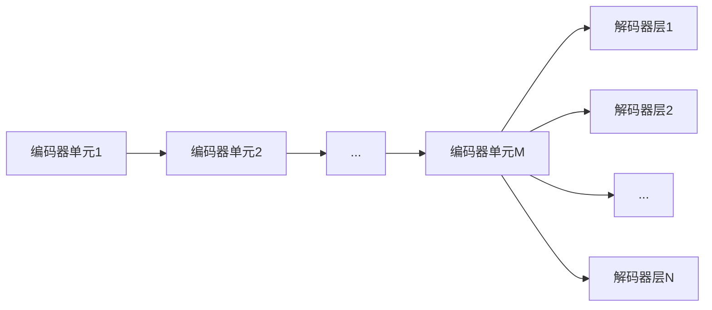

[[RNN]]
##### Intro
于2017年NIPS上被提出，原论文“Attention Is All You Need”，用于翻译任务。
##### 流程简述

- 编码：目的是将一句话中的一个词，转化为一个512行的列向量。其中包含
	- 这个词的语义信息
	- 这个词的位置信息
	- 这个词与其他词的相互作用信息
	因此
- 解码：
##### 关键概念
- 
- Embedding-词的向量化表达
	经典方法1：one-hot
	经典方法2：单个数字映射
	主流方法：Embedding，介于one-hot和每个词用一个数字表示，这两种极端方法之间的一种词的向量化表达方式。已知词表长度为n，再设定一个维度参数k，

	
	
		- a. 使用BPE等算法进行分词
		- b. 分词之后查找语料库得到索引
		- c. 快捷的one-hot向量嵌入计算（直接按照索引值取嵌入矩阵对应列作为嵌入结果）
		- d. 至此，所有token的维度统一为512维
	- 叠加位置编码：
		- a. 将每一个输入向量与一个基于规则的同维度的位置向量相加，作为Encoder的输入
		- b. 位置向量中每一个元素的计算规则是：
			- i. 对于处于奇数位置的元素，有ele = cos(pos / 10000^((k-1)/512))
			- ii. 对于处于偶数位置的元素，有ele = sin(pos / 10000^(k/512))
			- iii. 是的没错，位置向量中每一个元素是关于pos和k的二元函数，其中pos指当前输入向量在所有输入向量的序号，k指当前元素在所有512个位置向量全体元素中的序号
		- c. 有两个关键的问题，解释起来较为复杂，先留在这里：
			- i. 输入向量在输入Encoder之前为什么要叠加一个位置向量？
			- ii. 位置向量的计算规则为什么这样设定？
				- 为什么是三角函数？
				- 为什么区分奇偶？
				- 为什么是括号内这个形式？
	- Encoder计算

- Interesting Question:
	- 编码后向量用作KV而不是Q的原因？
	- 并行性如何体现?
		- a. 单个样本内的多个词并行处理：
			- i. 编码过程：嵌入词向量叠加位置编码向量后，独立编码，解除串行依赖，一次性得到所有3个编码词向量；
			- ii. 解码过程：
				- 训练时：对
				- 推理时：无法并行，依旧是一个串行的自回归过程
		- b. 多个样本的并行处理
			

