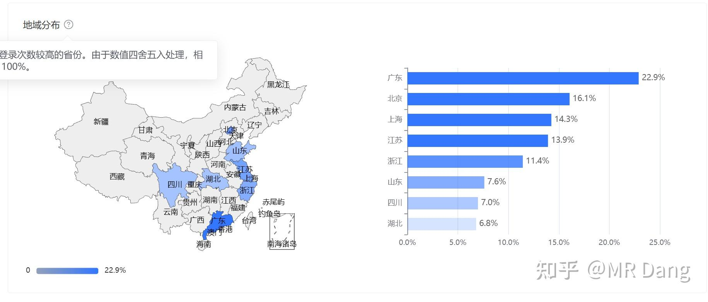
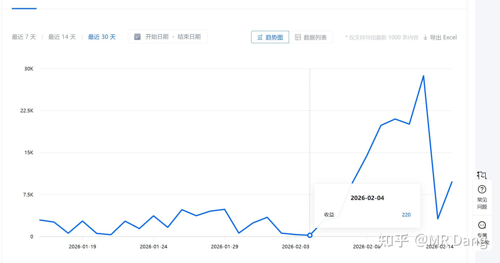

各位股东新年好啊，今年最后一天了，来点轻松的。

先看下喜闻乐见的IP分布图：

*最新IP分布*

基本上变化不大，因为距离上次才增加了一万粉丝。

后台变化大的是有一个叫做致知计划的官方激励，最近算法变了。

之前我写一篇文章，数据很好的情况下，收益是几块钱，大概相当于你们送的半杯咖啡。

在上个星期改版后，收益直线上升，如果点赞数评论数很多的话，一篇文章的收益增加了近百倍，目前已经能达到一天两三百块钱的水平。

*致知计划*

其他博主我不太清楚，个人感觉如果这个收益能持续下去的话，对新人来说在知乎做输出的性价比就挺高的了，有想做自媒体方向的不妨考虑认真研究下。

说到收入，还得说下氪金，氪金我这几天就关了，好好享受下假期是一方面，另外就是收入达到平台的上限了。

不知道算不算冷知识，知乎一个月的咨询费收入最多就是10W，超过了就取不出来了。我做这个也怕麻烦，所以不接受私下的交易什么的，税务方面一定要合规合法。

单月达到上限就不接了，有需要的话可以提前约，等年过了再排单。

另外，每年都建议大家看下春晚，倒不是对节目有什么太大的期待，主要是有时候会有些投资线索在里面。

大过年的，也不说多的了，一篇贺辞送给大家。

---

丙午除夕致股海诸君贺岁:

岁维乙巳，时届除夕。

野猪岩暖于庭前，爆竹喧于万户；

寒尽春生，星回斗转，桃符焕于千家。

辞灵蛇之旧序，迎神骏之新元。

此诚新旧相代，举国同欢之辰也。

某不才，一介布衣，耽于市道之研，守于价值之辨。

自与诸君相识于屏前，相聚于股海。

虽无兰亭曲水之雅，而有同袍共济之诚。

虽无金谷飞觞之盛，而有朝夕论道之契。

回首旧岁，A股潮起潮落，板块轮转如风。

虽经波折，而信念弥坚，此诚股海行路最难能者也。

夫丙午马年，骏骨生风，天马开道。

昔《马说》有言：“世有伯乐，然后有千里马。千里马常有，而伯乐不常有。”

股海之道，亦然也。

千股林立，如万骏聚于厩。

非有慧眼，不能辨其神骏；

非有耐心，不能待其绝尘。

愿诸君于新岁，具伯乐之明，选股如相马，察其内质，辨其潜力。

避驽骀而选骐骥，舍浮伪而取真藏。

具老马之智：临盘如驭马，明于进退，慎于取舍，不随潮而盲从，不临险而妄动。

具天马之姿：持仓如驰马，乘风而上，奋蹄而行。

**持仓皆为千里驹，账户尽呈长虹势** 。

昔所共论之各行翘楚，各业之王，皆当如神骏踏春，绝尘而起，不负诸君之深耕，终成岁末之厚报。

然股海行舟，非唯利之所趋，亦心之所炼也。

愿诸君于新岁，守正心而戒贪，持静气而戒躁，不以一夕之涨而骄，不以一日之跌而馁。

如良将驭军，进退有度，

如良工琢玉，不疾不徐。

以价值为缰，以理性为鞍，

纵有关山万重，终能驰而不息，得偿所愿。

今夕除夕，万家团圆，灯火可亲。

谨以寸心，寄此短章，敬贺诸君新春之禧。

愿诸君：

**丙午新岁，马到功成。** 

**账户长红，骏业长兴！** 

**阖家安康，万事顺遂。** 

**春祺永纳，福泽绵长！** 

谨奉芜词，聊表贺忱，伏惟钧鉴。  

丙午除夕

MR Dang亲笔

