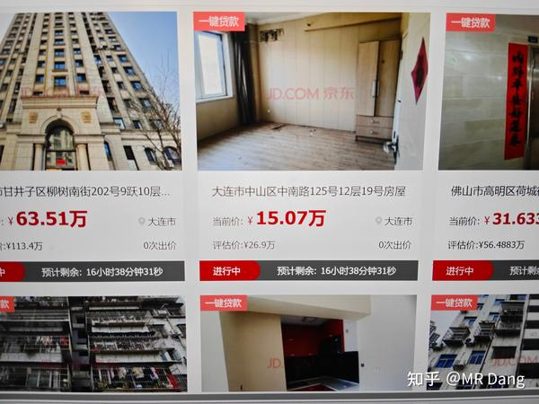

好问题，很多人的切入点在对楼市，对房价的影响上。

我分成两部分叙事吧，实在是被删怕了。

---

首先，就房价来说。

可以类比成股价。

你看股灾的时候，为什么参与极限引力挑战的人就多了？

因为短时间内，跌的太快了，**来不及换手** ，伤害都被一个投资者承受了。

而一个人的抗性是比较低的，受到的又是真实伤害，受不了就回泉水了。

股价从100跌到30，中间不带喘气的，是个人都受不了。

但是慢熊市的话，虽然对人的折磨是极致的，痛苦的。

不过因为跌的够慢，时间够长，所以换手是充分的。

股价同样是从100跌到30。

a接盘100到90的部分，失败了，去铁人三项了，一个月一万。

b接盘90到70的部分，失败了，去铁人三项了，一个月9000。

c接盘70到50的部分，失败了，去铁人三项了，一个月8000。

d接盘50到30的部分，失败了，去铁人三项了，一个月7000。

abcd共同承担了100跌到30的伤害，而且他们有四份铁人三项的工作去还钱，所以不至于冲动去重开。

房价也是一个道理，如果房子带杠杆，在一个人手里一直从头拿到尾，那么也是会出问题的。

最好的办法，就是把这些房子**匀一匀，加大换手率** ，把伤害分摊下去，那就不会出大问题。

你如果能get到这个设计的巧妙，你就知道我为什么说：

**房子除了刚到不能再刚的刚需，一套都不要留。** 

和哪里的房子没关系，是房子就往外丢。

当然你说什么安全感，归属感。

那没办法了，安全感是需要付出代价的。

房价的波动就是需要你承担的费用，如果提前想通了，觉得可以接受，那也可以。

除此之外，什么置换的，改善需求的，你租房能花几个钱，打开app输入你的预算，海量的房源等着你。

你置换，改善，这个行为就是换手率的分子，相当于主动去承担房价下落的伤害。

**你参与房子的换手过程，就一定会赔钱，赔多赔少的问题。** 

**下落的飞刀不要接，房子和股市都一样。** 

---

其次，从银行角度来叙事。

我不知道有没有人注意到处置平台的界面。

每处房产的左上角都有“一键贷款”四个醒目的大字。

有些银行啊，净利润连年增加，经营性现金流却是负的。

现金少了，净利润多了。

银行手里的资产都是什么，好难猜啊。

其实事实上，这些资产的评估价和真实市场价值差了最少有20%。

以银行成千上万亿的资产规模，稍微计提一下，那就是惊天动地的大事。

但是，如果房子挂出去，换个手，哪怕再把贷款放出去，只要每个月几千的利息有人还。

甚至都不用几千，还个几百块。

这笔上百万的资产就很“健康”，起码看起来是这样的。

---

一个喜欢保护韭菜的博主，希望大家少少踩坑，多多赚钱。

