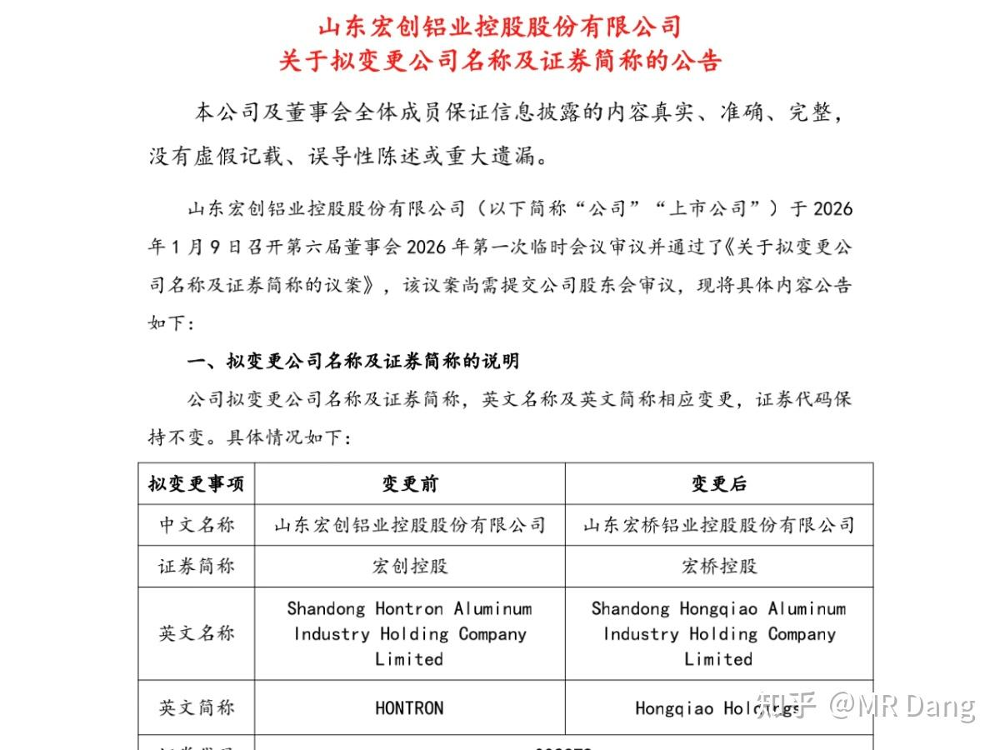

今天的内容做成一篇地阶功法也是可以的。

但是最近事情比较多。

眼看着紫菜组合要止盈了，在研究一个困境反转的低估标的，不是光伏那种反内卷的困境反转，是已经反转，正在进入景气周期的公司。

所以只能是长话多说，在周末闲聊这里聊点硬核的东西。

---

投资者在资本市场，最基本的一件事情就是要找准自己的定位以及自己适用的体系。

体系大概分为两类，**强者** 体系和**弱者** 体系。

所谓强者体系，就是你认为自己比市场聪明，你要主动的给投资标的去定价，然后坚信自己的定价比市场上其他的投资者更准确。

你要对市场说No，有些股可能常年累月都是低估的，你也敢勇敢的买进去，有些股可能常年累月都是高估的，你也能提出质疑。

总之在你眼里，市场就是一大傻子。

与之相对的就是弱者体系。所谓弱者体系，就是知道自己不如市场聪明，所以跟着市场来，相信市场的定价都是合理的。

涨了是合理的，跌了也是合理的，涨了又跌了也是合理的，跌了又涨了还是合理的。

总之市场就是大爷，说啥都是对的。你要做的就是在大爷开口说话的瞬间立马听它的话，然后等大爷给的奖励。

---

这两者没有孰高孰低，都能在资本市场挣钱。

但是怕的是什么呢？是**定位偏离** 。

明明没有信息优势，没有知识储备，没有资金优势，却误以为自己是强者，搞挖掘冷门股，和趋势作对这一套强者才干的事情。

明明自己有比较多的资金，有学科优势，有知识储备，有信息优势，有脑力加持，却放弃自己的优势，去搞打板，追涨杀跌这一套。

---

**强者体系和弱者体系的投资者之间是有沟通障碍的。** 

比如常见的沟通场景就是强者体系的投资者指着一个跌跌不休的股票，说这东西如何如何低估，如何如何好，市场错杀了。

弱者体系的投资者反手就是一句：跌有跌的道理，市场永远是对的。

或者强者体系的投资者指着一个涨幅脱离基本面的股票，说这些东西如何如何高估，风险如何如何大，市场炒作而已。

弱者体系的投资者反手就是一句： 涨有涨的道理，市场永远是对的。

他们之间一定有对错么？

也不见得。

低估是真的，低估的股票还能继续低估也是真的。

高估是真的，高估的股票还能继续高估也是真的。

但是两者经常因为对市场的不同态度而争论起来，市场观的差别会让两者根本无法沟通，都觉得对面完全无法理喻。

---

大部分投资者其实都是弱者体系，其中少部分投资者经过多年的交易，超额收益率会让他得到自信，慢慢转变成强者体系。

也有天生的强者体系投资者，属于初生牛犊不怕虎，大部分都是被市场磨平棱角，最后道心破碎，成为弱者体系投资者的一员，反而提升了收益率。

只有极少极少部分的天才，从一开始就是强者体系的，做的顺风顺水，最后成为投资界的传奇。

至于我的话，经历更曲折，有一个强—弱—强的变化过程，所以对两边都还比较熟。

---

上周给孩子买的铂金条压岁钱还没发到他们手里已经开始升值了。

我研究了下，铂金条比其他金属好鉴定，哪怕不用光谱仪。

因为铂有一个特性，密度排第三，21.45 ，比黄金的19.32还高。排它前面那两个有一个比是它贵的多的铱，另一个是被严格管控流通的锇。

所以只要你会基本的排水法测密度，当一回现代的阿基米德，算出来密度，就能鉴定出真假。

铂不只是密度比黄金高，熔点也超过了1700度，比黄金一千多度的熔点高的多。

铂作为投资品，金融属性远远比不上黄金，折价多，流通性差，没共识，一次买卖的摩擦成本超过了5%，所以不适合多次买卖，只适合一次投入，就死拿很多年那种。

但是铂的工业属性更强，是著名催化剂，在汽车尾气净化和氢燃料电池中都有大规模的应用。

从供需关系来说，铂的开采难度非常大，一吨矿大概产出1克铂，是很多金矿的几分之一甚至几十分之一。

我们国家是贫铂国，90%以上依赖进口，剩下也基本是回收利用，我们的铂矿大概每吨只有0.3克铂，是南非的三分之一都不到，开采成本极高。

铂的丰度是百万分之0.005，大概只有黄金的三十分之一。

每年铂的总产量不到200吨，而黄金达到3500吨以上。

铂的80%以上供应靠南非，所以只要南非出问题，铂的价格就会飞起来。

买铂有点像买一个赌南非局势出问题的期权，听起来有点不道德，不过确实可以因为那边的局势动荡而获益。

目前铂的价格只有黄金一半，从估值角度来说，个人觉得属于相对低估，这也是我下手买铂的原因，仅供参考。

---

周末一般不聊股票，不过实在是后台问的人太多了，就不一一回复了。

也没多大的事，就是铝王平替改了个名，亮出了铝王的本名，另外就是下周二开始发新股，市值一下跳到三千多亿。

影响的话，两方面吧。

一方面是**财务报表** 方面，铝王这个用财务术语说就是“同一控制下企业合并”，简称“同控”。

所谓同控就是合并前后，最后的实际控制人都是**同** 一个人，都是一个老板。

这个大概了解就行，这属于cpa会计里最难的内容，没有之一。

同控合并的一个特点是需要**追朔调整。** 

这个怎么理解呢，就是视同一开始就已经进行了合并，**而不是发公告的时候。** 

相当于直接改变你的记忆，从此那个亏损的公司没了，你查看以后的报表的时候，上面会清清楚楚写着2024年爆赚，2025年也是爆赚，

同时我们的业绩预告规则就是2025年合并**后** 的业绩（假设225亿）和2024假设年合并**后** （大概180亿）的业绩比较，那这样的话基本触发不了50%的强制预告线，所以**不一定有业绩预告。** 

另一方面就是**资本市场** 的影响。

以前的铝王平替是路边一条，人见人嫌。

现在的铝王三千多亿，而且涨幅巨大。按照指数嫌贫爱富的规则，一定会被抬进指数里。

最基础最重要的就是沪深300，这个基本属于必进，影响巨大，参考另一家同体型的铝业**，被动配置资金规模能达到百亿级别** 。

沪深300是456规则，也就是5月审核，参考4月的数据，6月生效。

铝王卡在年报发布前完成重组，肯定赶趟。

然后还有中证有色，国证有色这些行业指数。

如果分红多的话（大概率），还能进红利指数。

如果esg做的好的话（中概率），还能进esg指数。

指数一进，后面呼啦啦的各种基金，各种基民就嗷嗷的往里冲进来了，流动性就会好很多。

毕竟新发的股票都是锁定的，减去原来大股东持股，实际流通市值也就两百多亿。

突然说要被动配置一百多亿的基金，属于天降接盘侠，对股价肯定是有冲击的。

以上好的说完了，但是也浇一盆凉水。

铝王这个重组属于**明牌** ，下周一如果有高开，务必谨慎，可以采访下昨天打板中石化散户的感受。

我都念叨了好几天了，不是什么大新闻。

现在买也只能是买它的成长，价值发现，看好它的预期，如果是为了投机，我劝你一定想好。

---

一个喜欢保护韭菜的博主，希望大家少少踩坑，多多赚钱！

