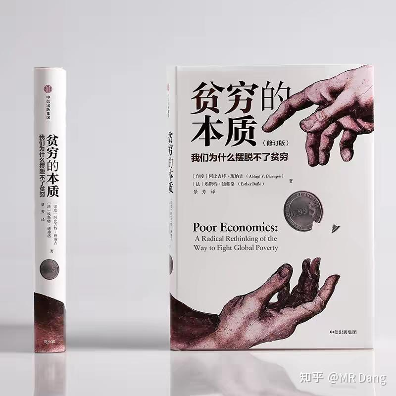
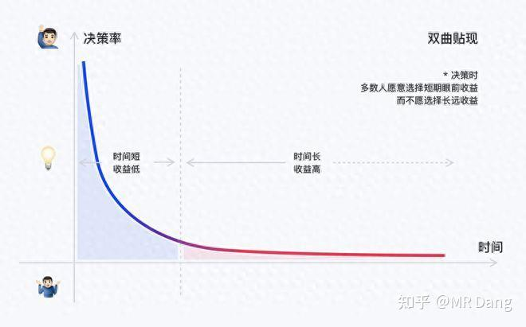
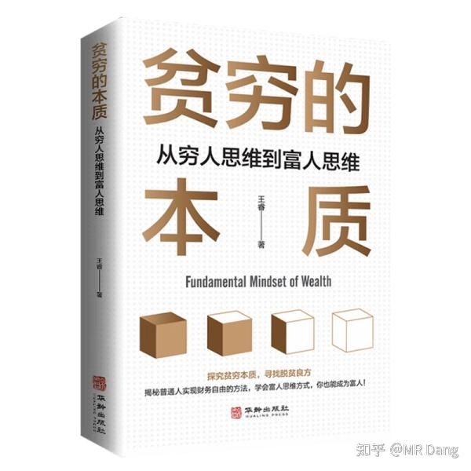

很多读者喜欢读书，今天给大家推荐一本行为经济学的书《贫穷的本质》。

这本书获得过诺奖，而且通过海量的对穷人行为的研究，揭露了穷人难以阶级跨越的几个原因。

我个人认为这本书有些观点还是发人深省的，但是由于研究对象主要是印度和非洲穷人，基本国情和咱们这边还不一样。

整本书的数据不少，逻辑也算自洽，非常适合当经济学的入门级科普读物。

---

你如果没时间细读，我也可以把其中的精华分享给你。

整本书中提到过几个新颖的观点：

1**，穷人之所以贫穷，是因为贫穷本身。** 

很绕的一句话，书中举了个例子：

比如研究发现，穷人用于奢侈消费的比例远高于富人。

当然这里的奢侈消费，并不是指lv这些。

而是说和收入水平不相符的消费。

一个饭都吃不饱的穷人，把钱拿去买电视，就属于此类。

其中的原因，三个字，不得已。

穷人多吃一口饭，除了填饱肚子并不能有其他收益。

但是如果饿很久的肚子，就可以买一台电视，可以获得穷人最缺乏的社会层面的尊重（自认为），可以丰富精神文化活动。

那么穷人是不介意饿肚子的，只要保持生命体征就行。

类似的例子还有非洲贫困家庭将额外收入用于购买高价精制食品而非营养均衡的廉价谷物。

贫穷本身剥夺了穷人选择的权利，无法做出最理性的选择。

把这点放到资本市场进行类比的话：

散户明知道打板九死一生，但是碍于本金太少，存在短时间内暴富可能的也只有打板。

不打板没办法暴富，怎么办？

硬着头皮上呗。

打板亏了一大笔，怎么办？

继续打板呗，不然价值投资猴年马月回本？

贫穷螺旋。

---

2，**信息不对称导致决策失误** 。

书中举例是印度贫困家庭拒绝免费疫苗，因为听信了“疫苗有害”的言论，导致贫穷家庭病死于可预防疾病的比例远大于平均水平。

这点的话放到资本市场里，就是资金量越少的散户越相信所谓的“内幕消息”。

事实上很多a股董事长自己炒自己家股票都赔了，人家是可以自己出利好利空消息的。

比如最近爆出的金城医药。

---

3，**期望效应与自我实现导致贫穷代际传播。** 

一方面是文化的影响，比如种性制度。

另一方面是期望效应与自我实现，低种姓的穷人被贴上“不聪明”的标签，认为自己如何努力都无法出人头地。

最后就自我实现，一代一代的贫穷下去。

期望效应和自我实现这两词还是我在考教资时候看的，属于教育心理学的概念。

用来解释贫穷的代际传播明显是不完整的，有点pua的意思，我个人对这个观点持保留态度。

不过这个观点放在资本市场也有类似的例子。

也就是**投资者的市场观很大程度决定最后的结果。** 

**市场观** 就是投资如何看待资本市场。

你把股市当赌场，那你就是赌徒，赌徒是什么结果呢？十赌九输。

你把股市当价值投资场，那你就是价值投资者，价值投资者长期是什么结果呢？慢慢变富。

当然也不是绝对的，赌徒里也有逆天改命的，价投里也有血本无归的，概率问题。

---

4，**金融排斥与高利贷依赖** 。

简单的说，银行是嫌贫爱富的。

穷人的还本能力弱，本金少，所以金融机构拒绝服务穷人。

最后导致的结果就是穷人只能去找不正规的高利贷，平均月利率10%以上。

这点在东大也一样，比如校园贷，裸贷什么的，很多人连年化利率都不会算，随便一贷就是年化100%利率的东西。

这就不是人类能还的起的利率，不管是谁，碰上就完蛋。

---

5，以上都不是重点，这本书的重点是**双曲贴现** 。

整本书最核心的，最重要的一个观点，就是**双曲贴现是导致贫穷的罪魁祸首。** 

双曲是什么意思？就是双曲线，高中数学圆锥曲线那里的知识，你看上面的图形就是双曲线。

贴现是什么意思？你可以理解为对收益的期望。

双曲贴现就是说对期望的收益分布率像一个双曲线的图形一样：对短期的收益有不切实际的幻想，对长期收益回归理性。

举个例子吧：假设资金的时间成本为0。

第一次选择：

A，现在马上接受100万现金。

B，一个月后接受105万现金。

二选一，你会选哪个？

第二次选择：

A，11个月后接受100万现金

B，一年后接受105万现金。

二选一，你会选哪个？

如果你两个选项同时选择了B，那么恭喜你，说明你是理性人。

因为A和B选项的差异都是多等待一个月的代价而获得5万现金，由于假设资金没有时间成本，所以是等价的。

但是很多人会在第一次选择中，选择A，第二次选择中，选择B。

为什么呢？

这就是双曲贴现，人在心理上对马上获得的东西有更高的预期收益，如果达不到心理上的需求，就会选择立马得到。

而随着等待时间的延长，则会回归理性，计算收益率，反正都等了11个月了，不差再等一个月。

简单的概括就是：**穷人更加短视** 。

书中举了几个例子：

比如在看病上，穷人更偏向于把钱花在治疗上，而不会在预防上投资。

疟疾高发区居民拒绝使用免费蚊帐，却愿支付高额费用治疗患病家人。

比如在教育上，更偏向于让孩子去打工，而不是提升学历。

因为打工是即时回报，提升学历是远期投资。

比如在消费上，如果得到一笔钱以后马上购买化肥，才能在种植的时候有化肥使用。

而如果没有立即购买化肥，声称等需要的时候再购买，则往往没等到购买化肥就把钱花完了。

---

双曲贴现这个概念对投资也是很有启发的。

很多做短线的对短线有着很高的预期收益，比如动不动一个月翻倍什么的。

反而很多价值投资者对年化收益率的预期收益只有10%左右。

利用这个心理，各大平台有很多起号的博主，都打着什么x年x倍的幌子，搞各种所谓的实战直播。

我建议大家对资本市场有个基本的了解，目前的公认的股神标准是长期稳定年化20%。

这些博主造假也分高中低档。

**比较low** 的就是东财一刷一大片的，用那种批量改数据的app做出来的截图界面，稍微懂一点股市的散户都能看出来真假。

这类博主的粉丝也少，目的就是引流，所以哪里有热度哪里就有这些人，永远是涨停后一看持仓，满仓最热门的股票。

第二天热点哪怕切换，你看他的持仓图，刚好就把昨天满仓的票换成了今天涨停的票。

至于啥时候换的你别问，问就是盘中择机低吸。

**中级** 一点的就是excel战神，雪球常见。

基本上万粉起步，一段时间出来更新一下excel小表格，表格里的票都是价投的票，而且是当年的当红炸子鸡，比如前两年的煤炭，这两年的有色。

对这些股票他们经常说的头头是道，而且巧合的是择时水平奇高，如果股票跌了一段时间，你看他的excel小表格就会发现已经清仓，如果股票表现的好，则会发现大幅度加仓。

这类博主的迷惑性很高很高，是雪球等平台里的大坑，数不胜数。

**高级** 一点的就是成名已久的头部顶流博主，比如某木头。

雪球十多万粉，比我雪球巅峰的时候粉丝还多。

发私募前号称x年x倍，年化80%收益率，最后发出去的产品两年几乎连续腰斩，去年剩下30%多清盘了。

还有很多类似的，共同特点是发产品前是卖家秀，发了产品就是买家秀。

说句难听的，我路边找条拉布拉多用爪子在键盘上随便滚一个代码说不定都比他收益高。

最防不胜防的就是造神产业链，比如某些头部公募，利用资金优势，打造个别明星产品/明星经理，最后产品发一大堆，收益率也基本没眼看。

**实盘≠真实能力** 

一个散户就几十万，中一个大肉签就年化50%，能代表真实收益水平么？

所以一定要考虑资金体量的，小资金量的收益率太容易造假。

---

为什么这么多投资者会中招呢？

为什么这么多基民会踩坑呢？

除了这些人的伪装技术太高明，还有一个重要的原因就是双曲贴现，真的太想暴富了，实在着急的不行。

**很多散户都有一个很坏很坏的交易习惯：在涨幅榜上找股票。** 

如果你也有类似的困惑，不妨看一下这本《贫穷的本质》。

当然没时间不看也行，看我这个精华分享也相当于了解其中五六成精髓了。

**这本书还有一本同名的书，封面类似，长这样：** 

**避雷！！！！！！！** 

---

一个喜欢保护韭菜的博主，希望大家少少踩坑，多多赚钱！

