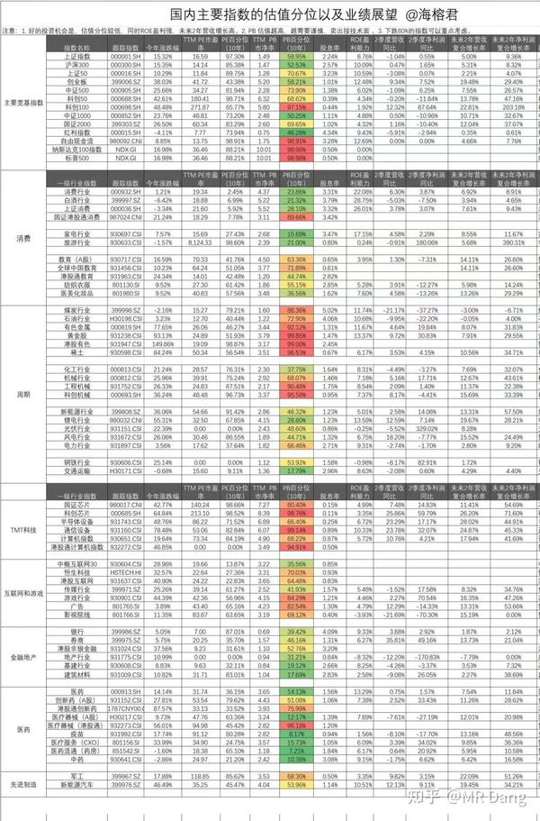

中美科技股的风险都在累积，两边凡是和科技沾边的，都看下估值，注意风险。

特别是散户，不要有科技崇拜，连个phd的头衔都没有，就不要用宏大叙事来给自己洗脑了，故事是讲给别人听的，钱可是自己的。

先说西边的泡沫，ai这轮行情最大的问题是目前还找不到最终买单人。

上万亿的订单是很诱人，很有想象力，但是这些订单目前是在产业链内空转，没有最终落地场景。

人很难想象自己没有见过的事物，但是ai最终落地的形态，一定不会是一个月几百美元的会员费。

以目前ai产业的投入和体量，最终ai落地一定是一个比手机市场要大，和汽车市场一个量级的行业。

目前ai产业投入是万亿美元级别的，全球人口82亿，智能手机普及率70%，假设ai终端最终渗漏率是智能手机的一半，35%，那就是对应不到30亿人口。

平均每人要花2000元人民币以上才有可能可以收回初步投资。

注意，这个投资是初步投资，这个渗透率是最终渗透率。

所以要支撑起这么大市值，一定是个售价比手机贵的终端。

是什么，目前还不确认，最有可能是机器人，也有可能是ai眼镜，也有可能是脑机终端，反正一定是有实物终端的产品，而不是什么版权费，会员费这些。

说服30多亿人花比手机贵的钱去为了使用权限付费的可能性，不能说是0吧，也是微乎其微。

科技的发展永远不是线性的，而是曲折的，是螺旋上升的，现在明显进度放缓了。

而资本市场的耐心是有限的，如果迟迟看不到落地，故事再好听也有听腻的一天。

有一个很危险的信号是，和我交流的很多投资者，已经真的把定投纳指当做无风险套利机会了，甚至要上杠杆定投纳指。

风险往往藏于无人注目的地方。

——————分割线————

尽管西边有泡沫，但是英伟达这种世界上最强的科技公司也仅仅只有50pe。

看看这张圈内疯传的估值表，东边科技这边的估值已经不能用丧心病狂来形容了。

我不是不看好科技，我不是不看好高估值的科技。

中芯国际破净的时候我买过，寒武纪110的时候我买过，你让我看现在的中芯和寒武纪，那是不可能下手的。

不是不够好，而是不值。

我10月10号提示科技股风险：

[10月10提示](https://www.zhihu.com/question/1959995529724429790/answer/1960010397475111055?share_code=u560zDBWRU1s&utm_psn=1962491413146076447)

10月11号提示风险，劝人跑路

[劝人跑路](https://www.zhihu.com/question/1960248139245155415/answer/1960287458966087566?share_code=1q6yRCuoJEnWr&utm_psn=1962492026852468399)

10月14号提示风险，劝人跑路

[14号劝人跑路](https://www.zhihu.com/question/1961437632753045924/answer/1961493079744812966?share_code=1eIZbzw17n5qF&utm_psn=1962493284355143044)

态度可以说是一以贯之，磨破了嘴皮，天天念叨天天被人骂。

现在科技股的高，不是那种今天买了，第二天到底会涨还是会跌的高。

而是整个板块在天上飞，根本看不到估值合理性在哪的高。

随便一个股，估值都比英伟达高。

这能合理？这符合常识？

市场上有这么多低估值的标的，为什么非要提着脑袋向科技冲锋呢？

————分割线————

那么就真的有没有低估值的科技股了么？

有的，兄弟，有的。

对于我这种胆小如鼠的投资者，又实在忍不住想投的，我建议你看看具身智能的配件企业。

这类企业的特点呢，他主业都比较稳定，偏传统行业，有稳定的现金流。同时他的主业和机器人部件有技术交叉的地方，有那么一丢丢的先发优势。

主业的现金流，企业的人才储备，以往的研发经验，在人，钱，技术，这三方面都能进行持续的投入，研发。

持续，这是个关键词，这个很重要。

因为科技行业更新速度快，研发周期长，随便一个技术路线的变更，就要死一片企业，只有可以稳稳跟住不掉队的企业才能分享最后的果实。

这类企业做不了行业领先者，但是可以吊在那些领头羊后面混一口汤喝，本身估值也不高，20多pe，情绪不好的时候就十几pe，你蹲个15pe的机会，那个时候你买进去，也就是他主业的估值，科技部分就当是蹭概念，白送的。

等风来了，市场狂热的时候，这种蹭概念的也会有人炒，新来的韭菜哪知道什么，概念板块一拉，估值最便宜的一个，嗷嗷的就冲进来了，你再阶梯式的减仓就行了。

至于是哪家企业，我一般在正文里不明说的，都是因为我觉得目前还有点贵，不想让你们因为我被套住的。

直接点名的，就是我觉得现价不贵的，你买不了吃亏的。

大家能get到的，说明你的认知已经到了，那你就视情况参与。

不能get到的，说明你的专业知识储备还不够，那就不要参与。

认知以外的钱，赚不到的。

————分割线————

已经两天没操作了，广告就不打了，忙不过来，哪天把手头的单子处理完了再来割你们韭菜。

所以我特别把以前的文章开辟了一个保护韭菜专栏，把最重要的几篇打包了，新手投资者可以经常翻阅。

还是那句话，希望大家少踩坑，多赚钱。

