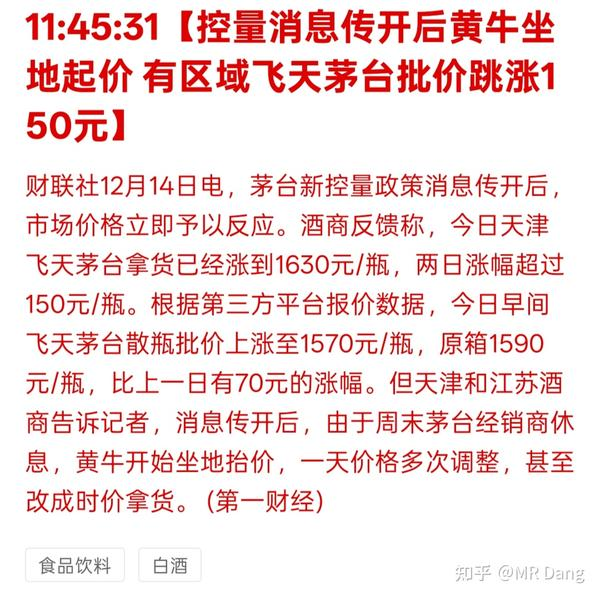
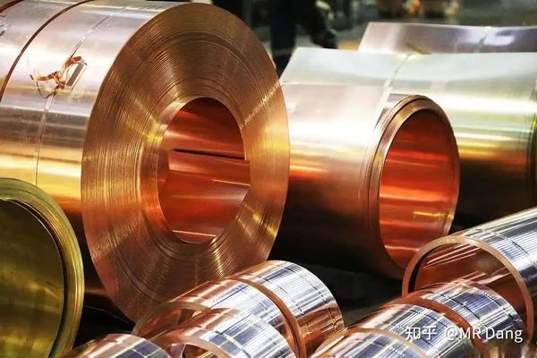
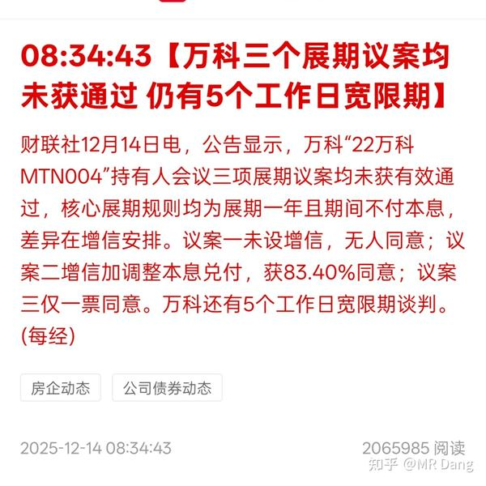
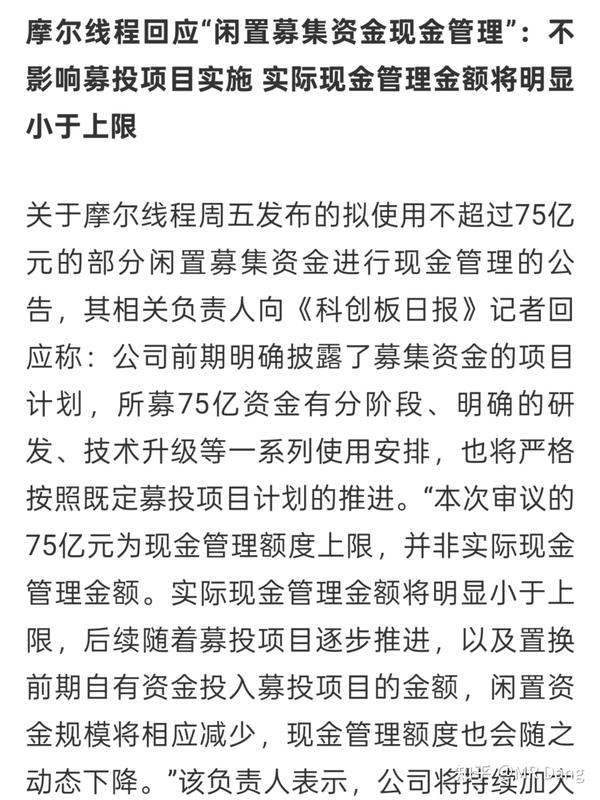
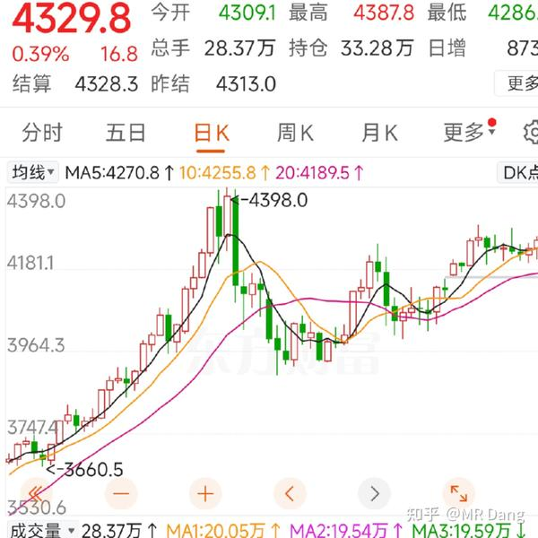
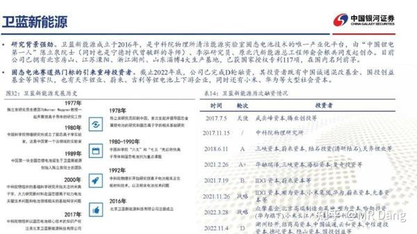

新的一周又开始了，先把上周五盘后的事情捋一捋：

国内市场方面，首先是茅子控价：

53度飞天茅台价格稳住了，对股东是一个好消息。

但是最终还是要回归基本的供求关系中，控量保价不是万能药，价保住了，量怎么办？

资本市场不知道会不会认账。

---

空调行业，部分企业积极推进“以铝代铜”。

现在一台空调铝代铜可能要差出去三四百块的成本，是很大的一笔钱。

之前董大妈曾经表示格力不会跟进。

其实格力是有品牌溢价的，享受品牌溢价的前提就是质量方面和用料方面的品牌形象。

其他任何品牌都能走以铝代铜，增本降效的发展战略，唯有格力要谨慎，格力是做差异化的，如果和云米去卷价格才是真的难受。

个人觉得格力的选择很正确。

我之前在一篇回答中提过，以后铜就是奢侈品，铜制电器会变成中产象征，正在一步一步应验。

---

w房企的债权人会议，展期方案没有获得通过：

简单的说，就是目前有三个方案，其中真正对债权人“有利”的方案是方案二，方案一是来凑数的，方案三比较灵活。

每个方案都需要90%以上才能通过，方案二现在接近，但是没有通过。

债权人的想法是什么呢，他们是距离最近的，现在公司账上还有钱，你别和我谈什么展期，本息一分都不能少，欠债还钱天经地义。

但是如果展期真的没有通过，然后公司没有按时支付，就会触发**交叉违约** ，其他没有到期的债权人也有权利提前要求赎回债务，直接就走程序了，典型的挤兑和踩踏，那公司基本就正式暴雷了。

爆雷企业就会有爆雷估值，至于什么是爆雷估值。。。参考其他已经爆雷的公司就行。

其实按照债务重组的定义，w房企哪怕展期也算是正式违约了。

现在还有五天的博弈期，这期间资本市场的波动会显著加大，甚至影响整个地产板块。

---

摩尔把ipo募集的资金都拿去银行理财了，有些舆论压力。

我有一计，目前摩尔的估值这么高，完全可以学习纳指的左脚踩右脚。

比如把50亿投给另一个公司，然后那个公司采购50亿的订单，这一下就增加了200%以上的营收。

市值不得增加几千亿么？

然后再增发股本，继续募集资金，少说也是百亿级别的，继续循环。

这不原地螺旋升天了么？

比存在银行理财强多了。

哦对了，沐曦股份本周上市，宫里要来新人了。

---

贴息在周末发酵，某些先行试点城市**新f** 成交活跃，增加了10%以上。

贴息的受益对象是谁呢？

银行算小半个，买新f的人算小半个，房企也算小半个。

至于二手老破小，更惨了，税高，没贴息，得f率低，层高低。

如果不是价格或者位置有特别优势，买f的人不会优先考虑二手f的。

有多套的，别犹豫了，最后的机会了。

到时候那啥放开征收，真的就是降价都跑不掉了。

换位思考一下，假设你要买f，会如何选择？

实在想不明白的，想想自从有了购车置换补贴后，二手车价都是怎么走的？

目前流传的版本，大概有4000亿的总规模上限，不是每年，先到先得。

贴1%，最多3年，也就是最多3%。

以上只是小道消息，不保真，以官方发布为准。

不过从以上也可以看出来，1.4净息差几乎就是画出来的红线，到了这个红线，想办法也要保住，不能发生系统性金融风险。

---

国际市场上，美股ai板块集体回调，纳指也回调。

主要是博通高管表示ai业务的毛利率不及预期，并且下调了业绩指引。

白银创新高后也回调不少，一般这种打的有来有回的逼空行情最容易出大烟花，越来越期待了。

只有黄金涨了一些，逼近新高。

按照我4500卖铜王的计划，只差一哆嗦的功夫了，铜王倒是争点气让我卖个高价吧。

---

正经事说完了，感觉气氛不太对啊，好像没什么利好，一眼看过去大部分都是坏消息。

来点玄学的。

最近在某些平台上，反q复m的民族情绪比较高涨。

对这个我倒不是很关心。

不过资本市场有股奇怪的风气，某些股票变成了反q复m概念股，或者大m王朝概念股。

甚至把这些股票和一些极端情绪绑定起来了。

我一度以为是搞抽象整活的，没想到有人真是这么想的。

不理解，但大为震撼。

---

袋鼠国发生kb袭击，目前报道的伤亡数量不少。

这种事情一般很难找到利好什么的板块，硬要说也就是黄金，安防之类的。

倒是对资本市场的情绪是一个打击。

---

西大抢了委内瑞拉一船石油扬长而去。

可能会对油价有扰动，但是委内瑞拉产油量目前占比小，就算有影响，影响也有限。

---

今天公布**社零** 数据和**f价** 数据。

对这两个数据都没很大的期待，到时候看看有没有个别亮眼的结构性机会。

---

本周三家央行会有动静，日本，欧洲，英国。

预期日本央行加息25个基点，欧洲央行按兵不动，英国央行降息25个基点。

这三组数据算是预期。

如果到时候按这个来了，那对资本市场不会有太大的影响。比如日本加息，前些天的很多交易都有折合预期在里面了。

但是如果超预期，比如一口气加了50个基点，或者其他什么的，就会影响到资本市场。

---

固态电池一哥卫蓝新能源启动ipo。

创始人陈院士是宁王曾董的导师。

据说2027年实现全固态量产。

现在的新闻通稿里都说估值185亿。

按照目前固态电池的热度，我目测上市第一天的市值可能就是千亿以上，就看是几千亿的问题了。

如果不到千亿，我不介意买一点。

当然能中签更好，大家都盯紧点，怎么看都是大肉签。

---

说到新股，差点漏了一个重要信息。

**据说北交所** 要推行市值打新了。

以前北交所打新，是无风险薅羊毛，不用买股票，有钱就行。

以后可能不行了，这种纯薅羊毛的行为被禁了，想要薅羊毛，先上船，不持有北交所的股票就没有资格了。

可能利好北交所低估值股票。。。emm，好像我持有的那个就是北交所估值最低的股票。。。巧了不是。

不过目前没有官方消息，这瓜不熟。

---

总的来说，有一说一，周末的整体氛围偏利空。

但是利空≠一定会跌，资本市场要是那么简单就太好挣钱了，随便看看新闻就知道涨跌了。

就像足球一样，踢之前的盘口代表了球队实力。但是最后的结果还要看哨声响起时计分器上的数字。

何况对价值投资来说，一两天的涨跌也代表不了什么。

目前我的计划就是看大宗的情况准备止盈铜王，换成锡王，有色只保留锡王和一点点的铝王仓位。

---

一个喜欢保护韭菜的博主，希望大家少少踩坑，多多赚钱！

