书接上回，先聊聊昨天发布的几组重磅数据：

一**.F地产** ：

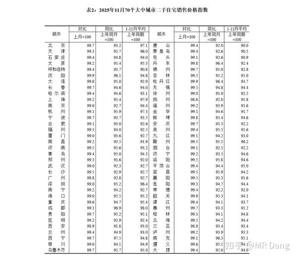

*二手指数*

对价格有指导意义的是二手F的价格指数。

我一介博主，就不发表意见了，引用统计局首席统计师的表述：

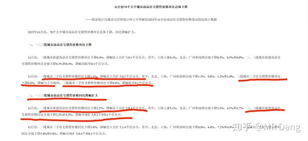

*权威表述*

**环比下降，同比降幅扩大。** 

画成K线图的话，相信大家脑子都能画出来。

预期不是很好啊。

值得欣慰的是，有几个老读者在挂牌了两三个月、被砍了好几刀后终于传来了捷报。

---

二,**工业，服务业，固投** :

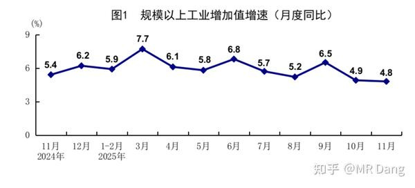

*规模以上工业增加值*

这个数据怎么理解呢？

"规模“以上是指多大规模？

**2000万** 

”增加值“是什么意思？

这个增加值是**扣除价格因素，扣除成本因素** ，对”产量“的描述，**新增产量** 。

连在一起，反映的就是大企业的新增产出量，是供给端的数据。

也就是说比去年同期增加了4.8%的**产量** （而不是产出价值）。

总体结论的话，也有官方定论，我截取其中的一部分：

**有效需求不足，企业盈利承压** 

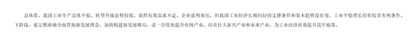

*官方解读*

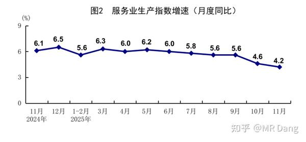

*服务业*

服务业还行，主要是**金融业** 撑着。

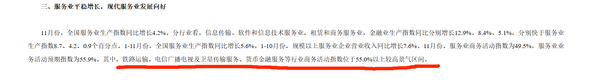

*服务业数据*

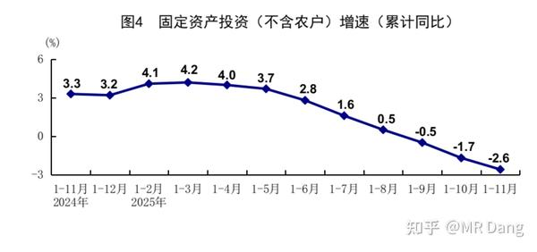

*固投*

固投数据受到FDC的拖累，逆增长。

如果结合社零的数据看，就更有意思了。

---

三**.社零** ：这个数据比较关键，1.3%的数据不太理想，如果再考虑CPI的话，以数量计算，可能是逆增长的。

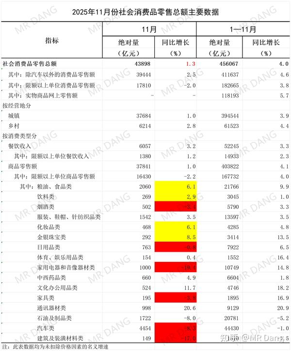

*统计局数据*

表格来自统计局，我只是把其中不太理想的数据标了红，比较好的数据标了黄。

总的来说就是大额消费还有进步空间:

**车，F，电器和酒。** 

表现还算可以的数据有：

**吃的，喝的，首饰和化妆品。** 

**口红效应显著。** 

代表了什么不言而喻。

之前的zc比较重生产，轻消费，重供应，轻需求。

现在统计数据出来后，最新的动向是也要扩大内需了，个别股票有所表现。

我的观点的话，我觉得一般人只有钱包鼓起来了才会考虑增加消费，收入问题是根本。

劳动性收入太卷了，那么多毕业大学生，不要指望太多，得靠资产性收入。

资本市场要有赚钱效应，上涨的个股数量就要够多。

盯着几个股票抱团就是自娱自乐，指数上去了也没用，股民又挣不到钱，消费就起不来。

F价也要企稳，不然早晨看着股市跌，晚上睡觉F价跌，第二天起来一看还降薪了，消费能起来才是有鬼了，指望贷款消费么？

---

回到国内事件，l3智驾正式落地：

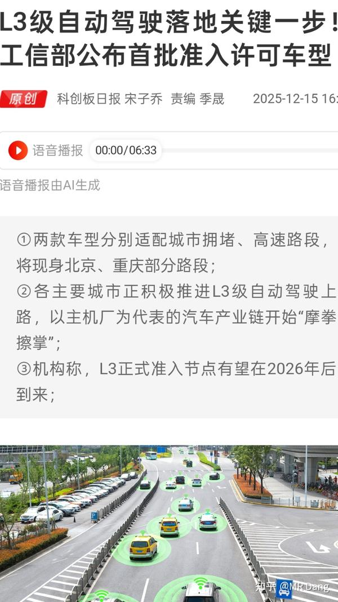

l3智驾在重庆和北京正式落地，虽然有速度和区域的要求，但也是里程碑的大事件。

第一批吃螃蟹的车企是长安和北汽。

---

**昨天白天铂期货涨停：** 

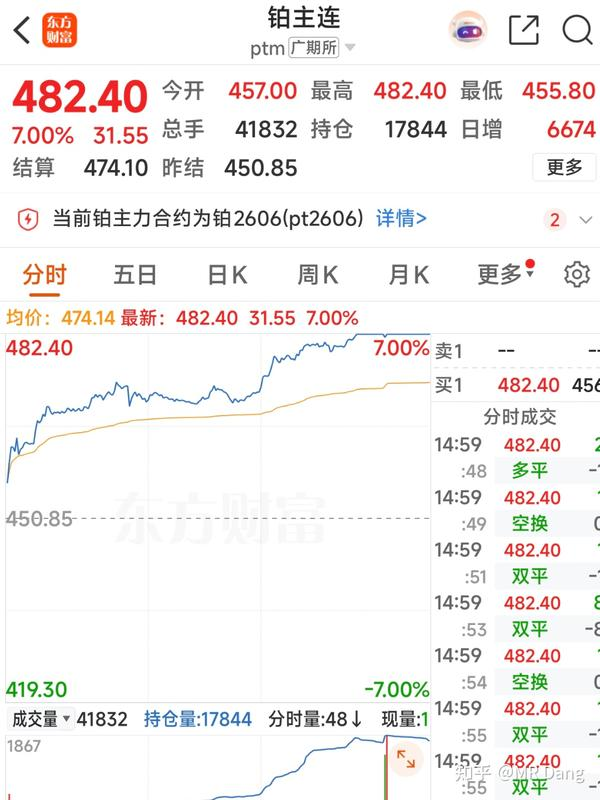

 这个铂之前提过，没什么好的标的，因为国内没矿，都是回收利用，只有两家企业，一家g企业和一家h企业。

回收的时候，如果铂涨价了，相应的回收物也会涨价。

和有色矿涨价不是一个逻辑。

只有存货升值有可能受益，但是这两家企业还有期货套保，所以存货能升值多少也不好说。

真的很想参与，只有期货市场一个途径，不过期货的风险……emm，别说新手了，老手也要谨慎。

---

我国已进入拉尼娜状态：

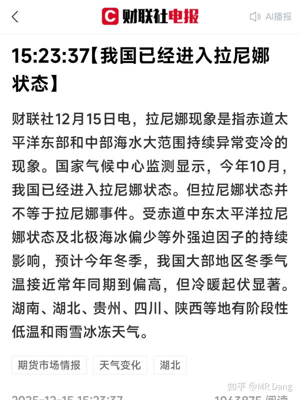

拉尼娜状态≠拉尼娜事件

但是可以当成拉尼娜事件去分析。

别管哪里热哪里冷，哪里旱哪里涝。

它对农作物都大概率不是个正面事件。

特别是果蔬一类的，对降雨和温度都很敏感。

叠加口红效应和消费数据，我合理怀疑过年前后的菜价估计还有的涨。

---

离岸人民币汇率盘中升破7.04关口：

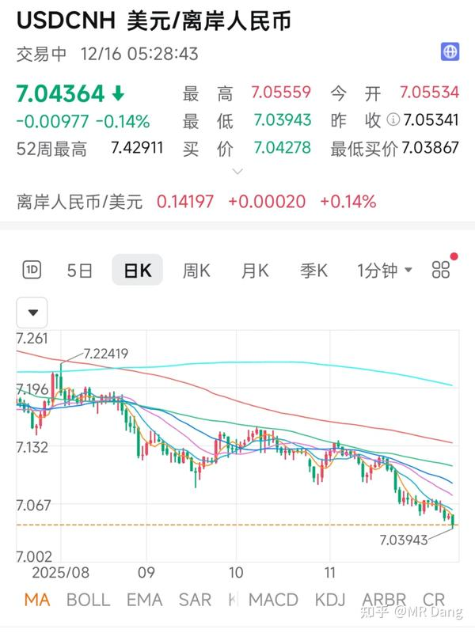

有利于国外资本回流，并且汇率升值的话，为降息留下空间。

不利于出口企业。

一般来说，传统认知中汇率升值利好航空公司。

一方面是因为以前航空公司都是从国外进口飞机，以美元计价。

另一方面航空公司的主要成本——燃油也是以美元计价。

但是现在有c919，就不能简单的这么一刀切了。

除此之外，就是利好存量美元债多的公司。

比如某h券商，z券商，t券商，他们的存量美元债从几百亿级到几十亿级，如果人民币汇率升4%左右，汇兑方面的收益就有十多亿到几亿不等。

双轮驱动的某商业地产公司x。

铜王。

zg某建。

大概有那么十来家，因为能在境外发债的就没有小公司。

但是大公司的利润也多，这几亿到十来亿放到别的公司是大数字，放到这些大公司的利润表里也就是锦上添花，还要看主业。

---

美股ai又跌了，带动纳指微跌。

中概股表现普遍不好。

事实上最近一段时间恒生科技也不太行。

投那边的南向资金受到了股价和汇率的双重暴击，短期持股体验比大A还难受。

前段时间评论区问恒科的人还挺多，最近感觉提的人也少了。

如果说大A是套10%以上才能考虑是否补仓，那么港股的话这个数字就是30%才有一定的安全空间。

港股瞎补仓真的是会爆炸的，谨慎！

---

至于今天的计划，感觉没啥机会，除非金价大涨，择机止盈铜王。

不是不看好，而是有更好的选择。

一个喜欢保护韭菜的博主，希望大家少少踩坑，多多赚钱！

（不知道审核多久，今天七点发）

