先回顾下上周的情况：

最主要的是几大央行的议息情况全部落地，全部都在预期内，资本市场几乎没有反应。

比如日本加息，早就被市场消化了，所以加息落地后对资本市场没有影响。

但是日本这次加息后，有一个现象比较反常，就是汇率反而崩了。

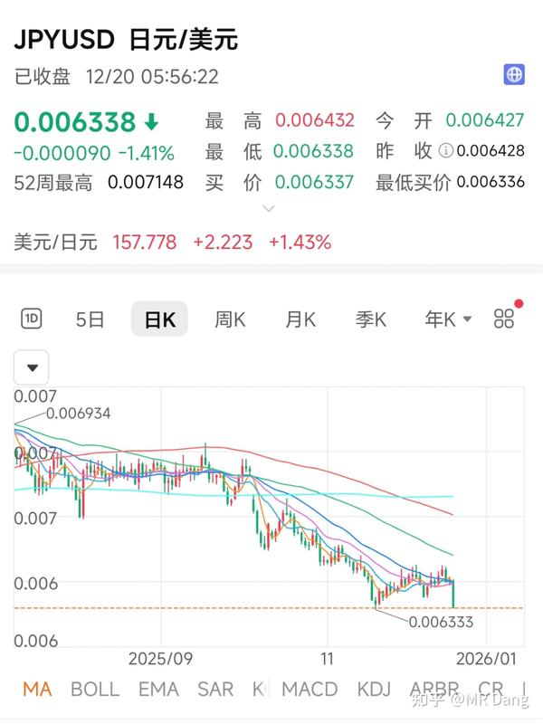

同时，长债端翘头，10年期接近2%的收益率。

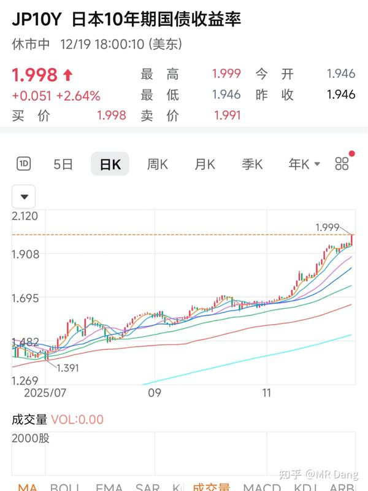

种种迹象表明，日本失去的xx年又要来了。

汇率保不住，物价压不住，加息25个基点根本不行，所以明年，也就是2026年，**日本还会有多次加息，以后加息很可能常态化。** 

而资本市场对相同的消息产生的反应是边际递减的。

比如俄乌，第一声枪响的时候还有点反应，现在再怎么打，除非掏出蘑菇蛋，都对资本市场没有多大的影响了。

日本加息也是，以后就习惯了，加就加了，还能怎么样呢？

---

国际市场，银价又创新高了：

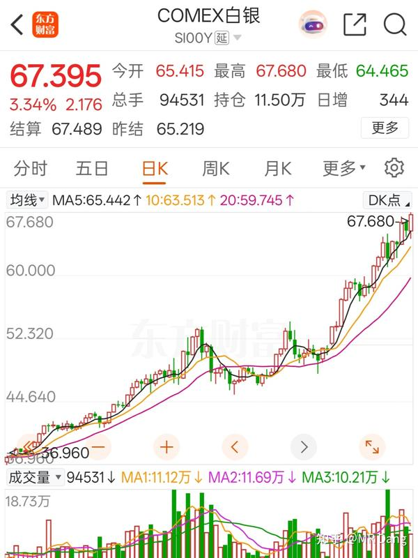

逼空是这样子的。

有的机构已经看到三位数的银价了，也有机构认为实际价值在50美元左右，多空分歧剧烈，最后就是靠钱说话。

不过目前银价走势没有走出超出以往斜率的曲线。

假设这是一场逼空的大戏，目前还没到故事的高潮部分，还属于铺垫环节。

---

西大的资本市场反弹不少。

爆出了68张图片的猛料，就挺辣眼睛的。

（不好意思串台了，应当放到娱乐新闻。）

---

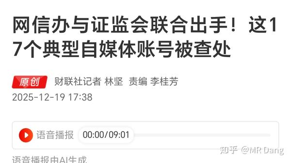

又清扫了一批典型的股票自媒体。

这种不正规的瞎写的自媒体太多了。

我记得以前某个大v看到腾讯还是哪个港股的热门股票停牌，开头就是《震惊！xxx深夜突发停牌》，然后一顿分析猛如虎，什么重组，业绩，合并，收购巴拉巴拉的。

我一看不对啊，这不港股挂风球了么？整个港股市场都停牌了啊。

一个连风球都不懂的大v，我甚至怀疑他有没有交易过港股都是问题，居然在那个平台混成了几万粉的大v。

这种分析能靠谱才是有鬼了，股票自媒体这行业入行门槛太低了，开局一张图，涨粉全靠P。

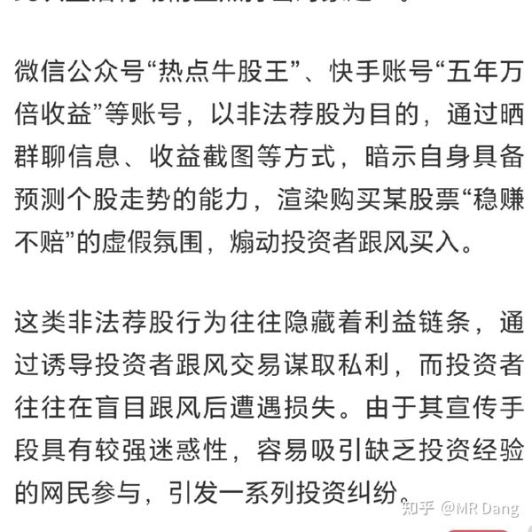

根据官方的表述，几个要素分别是：**群聊信息，收益截图，预测走势，稳赚不赔，煽动买入。** 

大家根据这几条自行甄别，同时也是对我个人的警醒。

每天冒出来的股票自媒体可能数以万计，靠官方这种零星的整治是能忙不过来的，必须加强自身的防骗意识和安全理财意识。

---

煤王发布重磅公告：

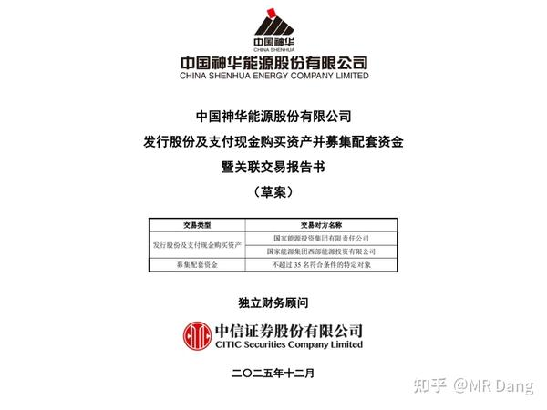

简单的说，就是收购“优质”资产。

收购方式是现金和股权增发相结合。

比较良心的一点是，根据测算可以稍微增加每股收益。

但是动用了这么多现金，未来的潜在股息率可能受到影响。

还有就是有些投资者可能会联想到DQ铁路。

我没有股票，我觉得如果假设我有的话，我可能会稍微有些**担忧** 。

我的评论区里煤炭股也是问的比较多的，有一些投资经验不是那么丰富的投资者还会问某某煤炭股，股息率十几个点，你怎么不买？

我想说的是，煤炭股的高股息率已经是过去式了，目前的煤炭股预期股息率高一些的也就5个点左右了，甚至都到不了。

而且从商品的角度来说，铜是铝的上位替代，油是煤的上位替代，现在油价都起不来，煤价就不要抱太大期望了。

含蓄的说法就是煤炭的供应在未来一段时间内会保持宽松。

---

宇树机器人在王力宏演唱会上大火：

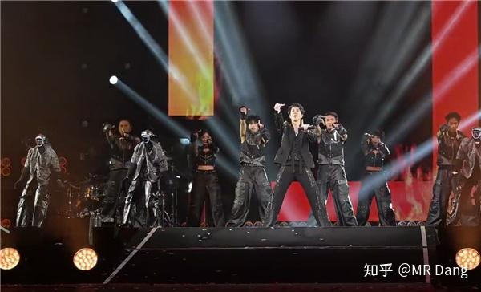

主要是马斯克转发了相关消息，彻底引爆了舆论。

不过如果关注机器人产业链的，应该知道机器人的迭代速度非常快。

在性价比方面，前一段时间有一个万元以内的产品小布米机器人。

在性能方面，有一个众擎T800，运动能力甚至比宇树机器人更高。

在适用性方面，有云深处的全天候机器人DR02，防水能力max。

所以这不是一两家公司的问题，而是整个产业链的优势。

---

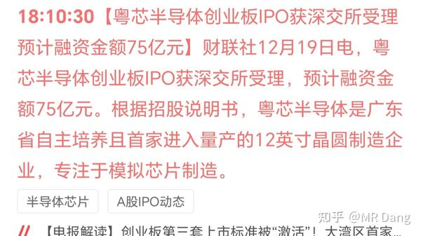

为满足广大投资者对优质半导体企业热烈期盼，又一家半导体企业即将ipo，融资额度75亿。

某水泥上市公司通过基金间接持有不到2%的股份，根据金融工具准则，对持有的部分应当归类为“交易性金融资产”，上市后市值上涨的部分计入“投资收益”，进入利润表。

成本大概是两亿多，假设上市后市值千亿，可能确认的投资收益在十亿左右的级别，折算下来大概每股一元左右。

看到没有，辛辛苦苦干一年，不如一级市场投芯片。

但是这个属于一次性收入，不能按照pe估值，要按照pb计算。

该公司目前市净率1.2，计算得知影响股价0.8元/股比较合适。

如果明天股价涨幅远小于这个数字，比如不到测算的一半，我个人考虑会进行**投机** 套利。

如果涨幅巨大，那我就会忘了这茬事情，当做无事发生。

请勿模仿！！！刀尖舔血！！！

还得是大A，对半导体企业的估值又高，上的数量还多，通过杠杆效应还能让持仓的基金保持高净值和大比例浮盈，良性循环。

---

海南封关的消息，沸沸扬扬了。

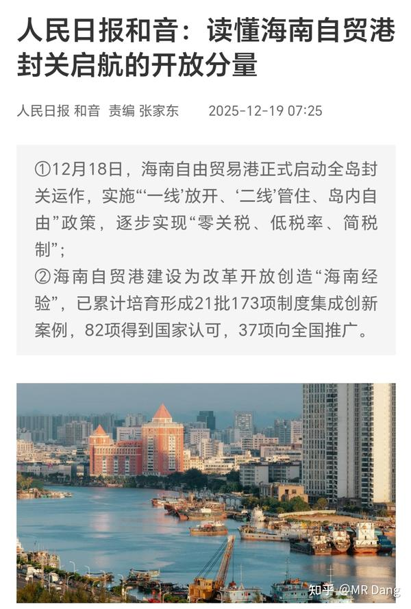

这消息酝酿很久了，没有信息差，现在冲进去要注意**风险** 。

要说利好的话，海南的交通运输，旅游类的感觉有一定的预期。

但是还是那句话，很久之前就有相关消息了，现在一定不是好的进入时机，一定要注意风险，谨慎！！！

---

超碳一号正式商用：

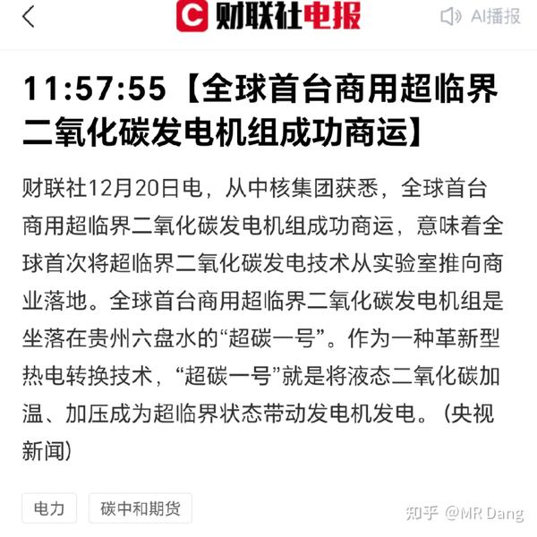

以后再也不能说“科学的本质就是烧开水了”，要改成“科学的本质就是烧二氧化碳了”。

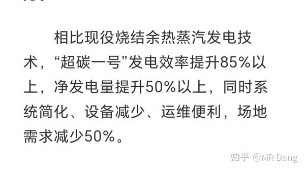

性能上，宣传的十分炸裂，不过以我朴素的科学观，我对这个发电效率提升85%以上表示谨慎怀疑。

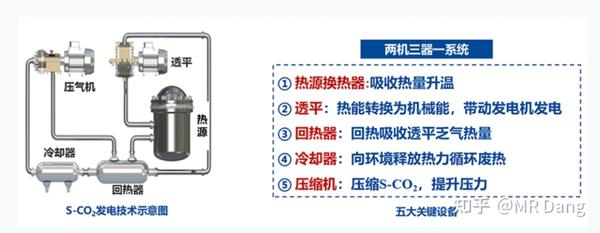

原理如图所示，相关标的可以自行问ai，我不是这行业的专业人士。

我只能说在那一长串名单里，我看到了几个熟悉的妖股身影，可能又要炒作了。

不建议参与哈，就一个原因，现在是消息落地的最后一棒，风险很大。

---

《中央企业违规经营投资责任追究实施办法》从2026年1月1日正式实施，损失超过5000万会被重责。

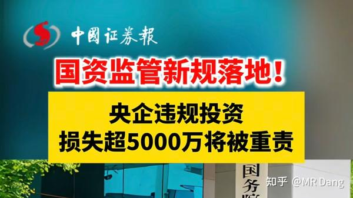

---

等下发布最新的lpr，预期的话是降准不降息，所以应该会保持不变，如果降息就算超预期利好。

今天智元机器人会发布一个租赁服务的大会。

hw新品发布会也在今天，不知道有没有出人意料的投资机会。

---

隔壁平台又在办嘉年华了，一堆大v共襄盛举，其中有个行业投票环节：

一开始画风是这样的：

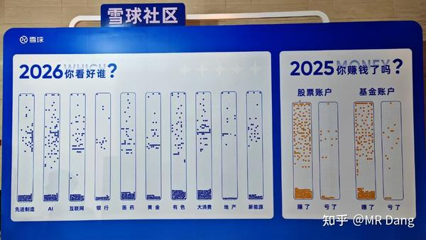

后来投着投着，画风就变成了这样：

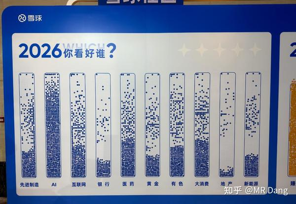

Ai行业和地产形成了鲜明对比，一个是一致性看多，一个是一致性看空。

这个投票怎么说呢？你可以理解为仓位摸底。

一般人不会投自己没有仓位的行业。

都在投ai代表了场内的大v都买了ai的股票，预期打的很满了，稍微不如预期，那表现就会崩。

同理，地产没人投，意味着没几个人有地产仓位，预期非常差，那万一地产跌的少了，比如明年f加只跌了五六个点，说不定就是超预期了，地产股表现也许还不会太差。

这有点逆向思维的意思在里面。

为什么东财热股是反向指标？因为大多数人都是屁股决定脑袋，如果市场上只有看多的声音，那就是屁股都进来了，是危险信号：

能买的都买了，没有潜在的接盘资金，那就是最后一棒了，不崩才怪。

去年让他们投，肯定不会有多少人投黄金/有色之类的，一个道理，今年投的也未必准。

**不能迷信大v，只不过是声音大点的普通投资者而已，打开账户看收益率，未必有你的高。** 

话说知乎能不能跟进下也办个类似的，然后把我喊过去，颁发个2025年财经领域百大新人奖之类的给我？

美滋滋啊美滋滋。

---

新的一周又开始了，祝大家本周也有斩获。

一个喜欢保护韭菜的博主，希望大家少少踩坑，多多赚钱！

