本周最后一天了，被揍了一年的白酒地产终于扬眉吐气了一回，正好看到张梗图，笑的我合不拢嘴：

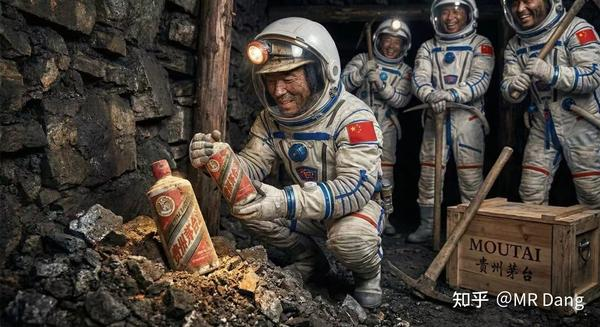

说实在的，就差了24小时，白酒和房企有什么基本面的反转么？

也没有，松绑三条红线这种事情难以扭转目前的房企资产负债表。

资本市场这种跌多了就涨，涨多了就跌的情况经常发生，**不能以股价涨跌去反推基本面，这是大忌。** 

之前我说吃一口粪坑里的巧克力豆，吃了以后差点消化不良，没敢吱声，没想到昨天还吃了个涨停。

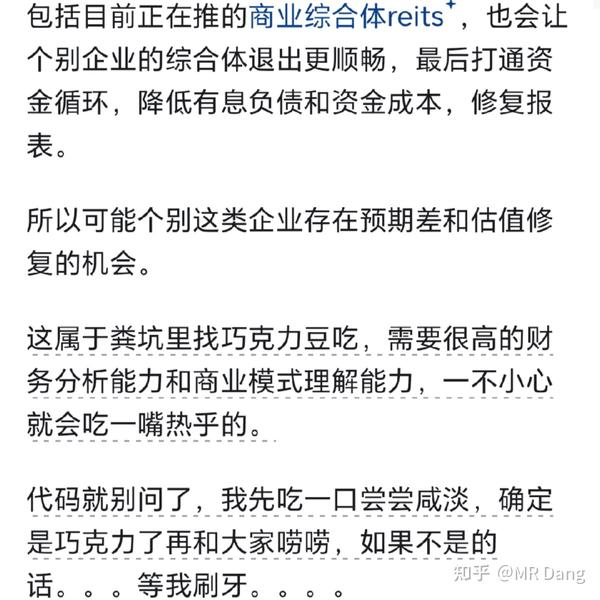

如果你非要参与，有色的钱想挣，房企的钱也想挣，既要还要。

那从思路上来说，我觉得可能一些就是做**商业地产的reits** ，已经发出去的，或者有发出去预期的，带来的资产重估起码还是个算得上的逻辑。

投融管退打通以后，商业模式就能跑的通了，就不能按纯住开去估值，很多商业地产公司的ROI都在缓慢增加，客流量，销售额都在增加，资产只要能按照报表中的数字出表，那市场价格就会向净资产靠近。

看不懂的就不要想了，有大把的好生意，没必要掺和。

能看懂的，知道是哪几家的，按按计算器衡量下风险收益，挑一挑，选一选，里面有可能筛选出一些爆发力强的东西。

这个本身就是一种门槛，也是保护，风险很大，没有股息率兜底，不要强行上车。

白酒的话，据说是在交易飞天茅子批价上涨的逻辑，但是这个说实话，每年临近春节都会涨，算是季节性波动了。

不管怎么样，里面的投资者真的是憋了很久了，由衷的替他们感到高兴。

---

隔壁平台开始专项治理：

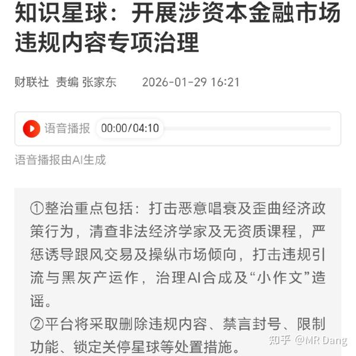

我感觉作为博主，打铁还需自身硬，不管到哪里都要行的端，坐的正。

不能因为到了一个相对封闭的圈子就放飞自我，这点我会时刻警醒。

---

布王发布业绩预告：

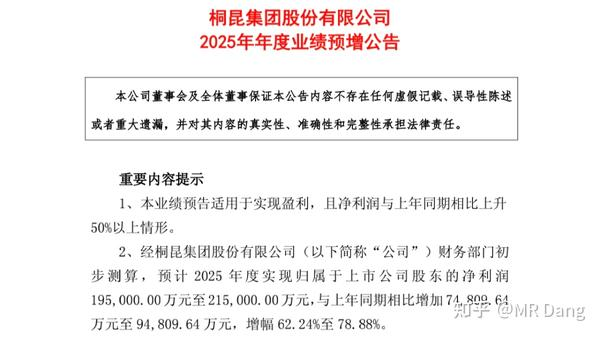

19.5亿到21.5亿，中位数20.5亿吧，符合我的预期。

我的预期在1月19的早报里有写：

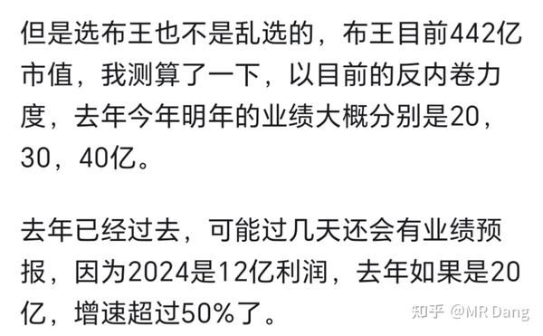

虽然目前没有仓位了，布王依然是不可多得的好公司。

---

金店发布业绩预告：远超预期

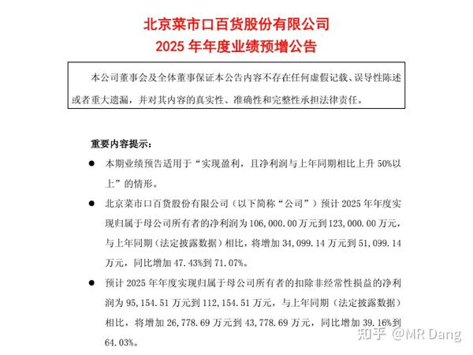

10.6亿到12.3亿，取中位数11.45亿。

则每股收益=11.45/7.78=**1.47** 

太逆天了，这业绩炸了，远超预期。

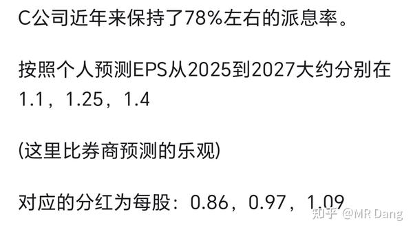

当时我已经比券商给的乐观了，25年只预期了1.1，目前的业绩直接干到预期中2027年的业绩了。

恭喜还持有的小伙伴，真是淘到宝了，目前股价涨了30％多，预期股息率还有5％以上，离谱。

有值得反思的地方，低估了大家买黄金的热情，低估了卖金条的暴利程度，应当修改盈利预测模型，及时跟踪数据。

（本人无任何仓位，仅代表个人看法）

---

其他公司业绩预报：

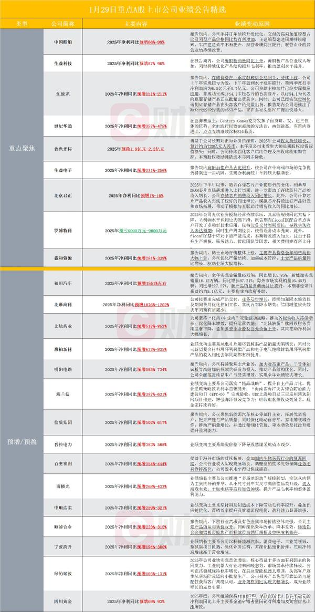

榜一的业绩有点。。怎么说呢，印证了1+1=1，合并后重工的业绩直接消失了。

榜3是模组厂商里的头牌，和我拿的那个存储一个赛道的，我觉得这业绩不如我拿的那个。

榜5是热点股，这业绩和估值我看不懂。

我比较关注的是其中一家造纸的，有行业反转的迹象，感觉可以跟踪下。

---

又到了喜闻乐见的大宗商品市场时刻：

布油：

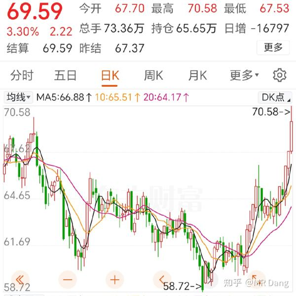

因为波斯的紧张局势，石油起飞。

目前的情况就是懂王让波斯自我核阉割，提了几个条件，不然就要动手，交易员们都在做看多石油的交易，去定价这个预期。

**白银** 巨震，比昨天下午收盘回调了三四个点：

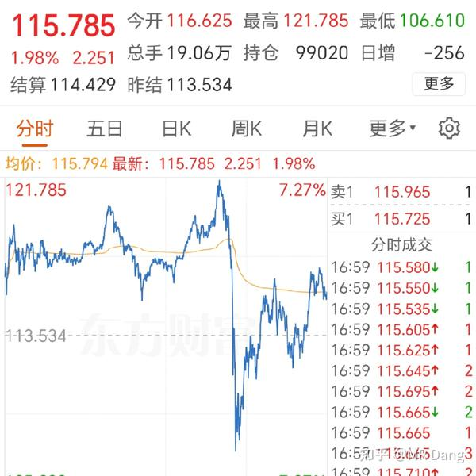

盘中最高121，最低106，很离谱的振幅。

**铜** 也是巨震：

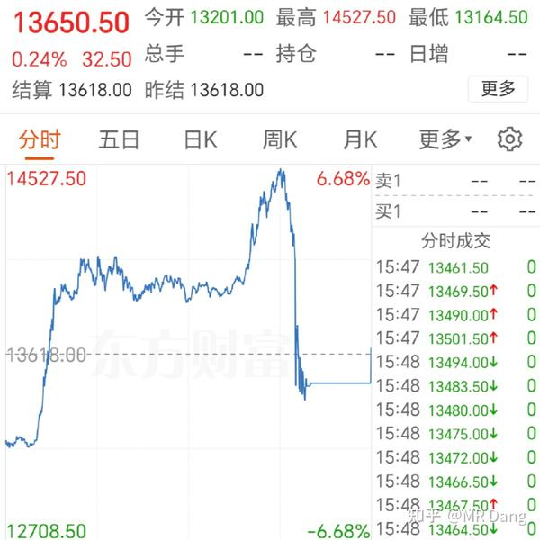

铜比昨天下午收盘也是回调了两三个点，盘中一度涨了十多个点跳水了。

其他的黄金，铝，锌，锡，铂，都是差不多的走势，巨震后收盘基本都比昨天下午回调了一些。

正如我昨天说言：

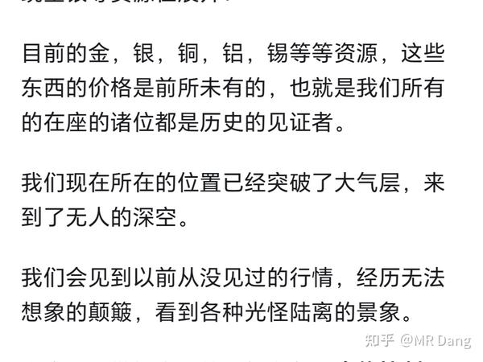

这正是无法想象的颠簸，光怪陆离的景象。

核心原因就是对目前大宗商品的定价，人类没有任何经验可以借鉴，历史上从来没有出现过这种情况，必然导致分歧加剧。

---

外围市场：

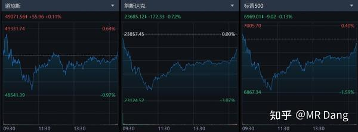

波动不大，盘后闪迪发的财报大超预期，涨了十多个点。

懂王下周官宣美联储掌门人，终于要落地了。

---

我昨天其实已经做好了挨打的准备，抱头蹲在墙角上了，结果银行股单骑救主，虽然资源股跌多涨少，最后还是躲过了这顿毒打，净值又创新高了。

但是这顿打是躲不过的，也许今天新仇旧恨就一起还账了，头盔已经戴好，绷带已经就位。

昨天盘中某个标的过了整数大关，算是到了提前设定的线，这种事情大家该怎么处理就怎么处理，原则放第一位。

哦对了，铝王平替正式改名了，今天就启用新名字了。

可惜名字里没加上一个铝字，导致含铝量下降。

A股就这生态，看名字炒股的人还挺多，整体认知水平参差不齐的，所以有些资金就会利用这个去浑水摸鱼。

至于今天的行情，A股就是个巨大的跷跷板。

如果老登继续发力，小登难免受苦，在目前总体指数非常平稳的情况下，肯定有人得做出牺牲。

老让大家控制仓位，不是喊口号的，希望大家听进去。

---

万粉感言的话，我想放到周日早晨发，不管当时有多少读者，题目都叫十万粉感言，应该不会差的太多。

所以**明天歇一天。** 

最近后台留言每天都是上千条没看的，翻到绝望，稍微翻一翻手机就卡了。

没办法预约，所以一直开着氪金通道，单子疯了一样的排队，明天集中处理下，更重要的是输出点硬核的东西出来希望可以帮到大家。

---

一个喜欢保护韭菜的博主，希望大家少少踩坑，多多赚钱！！！

