春节前最后一周交易日了，希望能给这个农历蛇年画下一个圆满的句号。

没有特别重要的事情，头条就给央妈吧，央妈的牌面必须有。

外汇管理局公布了最新的外汇储备。

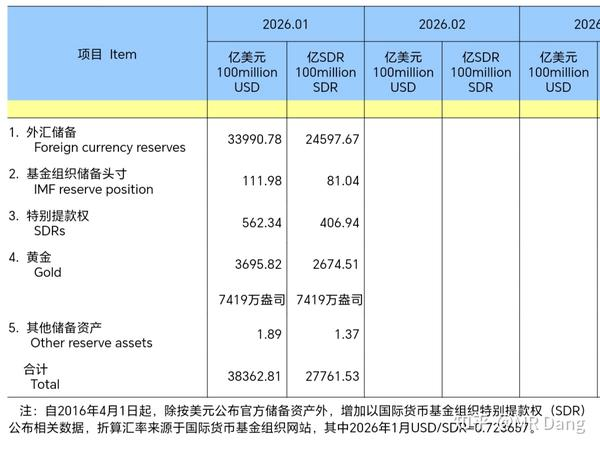

和去年12月比，黄金增加了4万盎司。

去年12月买了3万盎司，那说明今年1月比上个月多买了1万盎司，央妈买金也不看价格，管你这的那的，按需购买。

还有一个数据挺有意思，就是外汇储备，单月波动比较大。

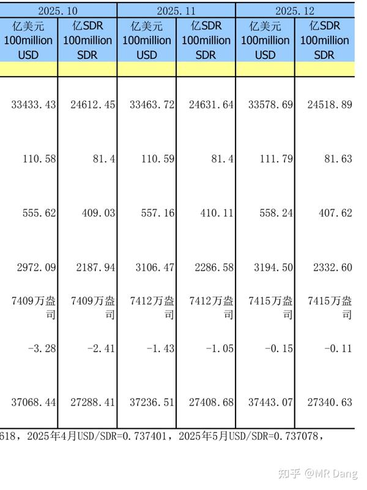

去年12月是33578亿美元，今年1月是33990亿美元，需要说明的是这并不是央妈增持美元导致的。

因为其他货币对美元升值了，所以以美元计价的话，就会造成外汇储备增加，仅看SDR，是在合理范围内波动的。

一月份的24597亿低于去年10月和11月的24600亿以上的外汇储备水平。

至于黄金，黄金的多头是各国央行，只要各国持续买金的节奏延续，金价就会被慢慢推上去。

仅仅印一点纸出来，就能换成黄金，这买卖挺划算的，尤其是对一些不太用考虑货币信用的小国来说。

---

有关虚拟币稳定币的官方定调：

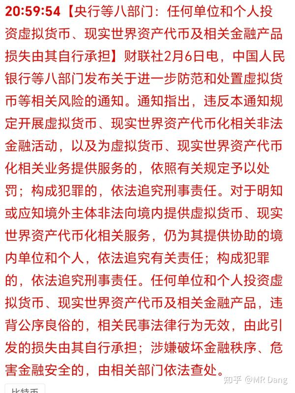

之前态度有过软化，特别是香港那边，有很多公司都传出来在相关领域有布局，最后都被紧急叫停了。

现在这算彻底堵住口子了，境内有关性质已经定调，大家还是要听劝，遵纪守法。

---

大宗商品回顾：

黄金：上周五收盘时是绿的，盘后涨了100美元，两个点左右。

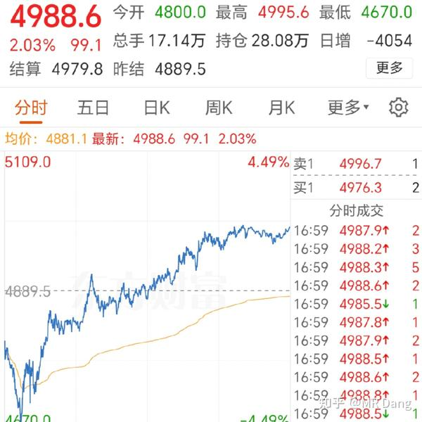

白银：周五收盘时跌五个点多，相当于盘后涨了六七个点。

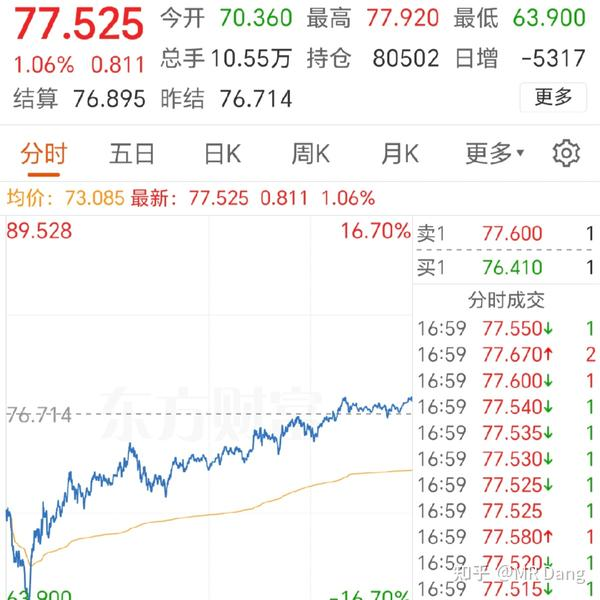

铝：收盘后涨了三个点。

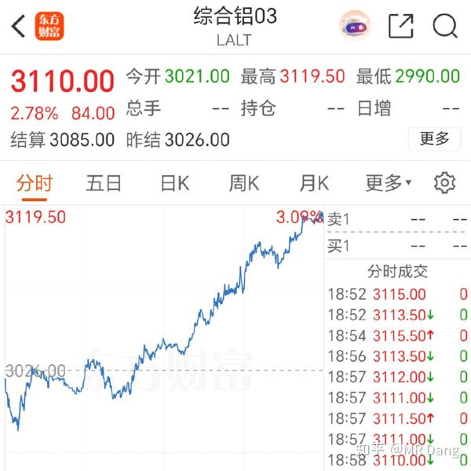

其他铜锡铂锌等有色金属和布油都有所表现，整体情绪偏乐观。

---

外围市场：

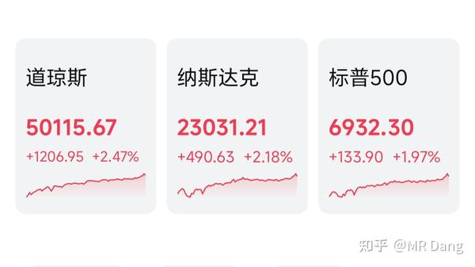

中概股普遍上涨，另外道指突破5万大关，懂王表示剑指10万点。

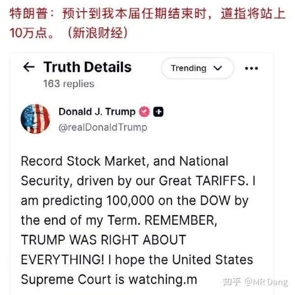

道指就30只成份股，目前里面的增长引擎除了达子，就是卡特彼勒之类的巨头。

卡特彼勒的估值逻辑正在从传统机械制造向发电靠拢，积压的订单超过500亿刀，未来两三年业绩有保障。

懂王说的道指十万点未必就能兑现，但是懂王不说标普，也不说纳指，单独给道指立下一个目标，这也算给定投美股的人指了条明路。

隔壁选举结果出炉：

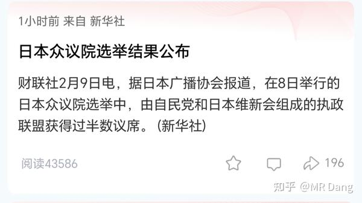

两边属于背道而驰了，以后摩擦不会少的。

---

预制菜新国标酝酿中：

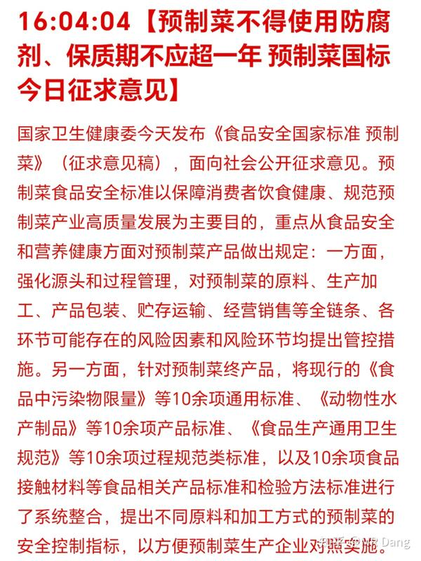

说到这个就不得不提到老贾了。

按照目前的界定标准，老贾的辩解是站得住脚的，净菜，主食，中央厨房都被排除在预制菜范围之外了。

但是问题不在于他是不是对的，而在于消费者还喜欢不喜欢这个品牌，从这一点上来说，毫无疑问输的很彻底。

回到这个行业标准上来说，如果能落实的话，可能最利好的就是中间的保鲜环节，比如冷链什么的。

毕竟不允许加防腐剂，怎么保鲜是个大问题。

以后预制菜成本会大幅度上升，售价会变贵，有可能从低端菜品变成中端消费。

---

商业航天一则消息：

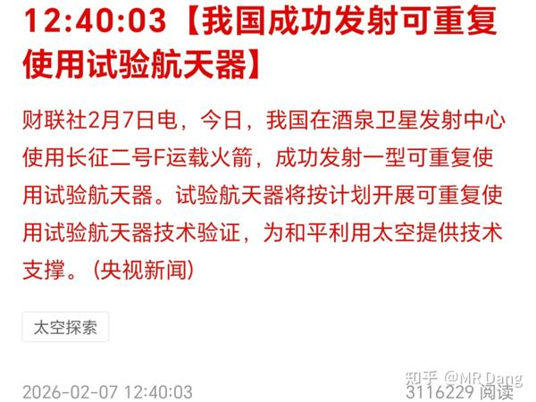

这种消息以后就是常态，随着发射的次数越来越多，无论是成功还是失败，对资本市场的影响会越来越小，想炒作的话得注意风险。

哦对了，看清楚，说的是航天器，还不是火箭，不要自己脑补。

另外还有老马：

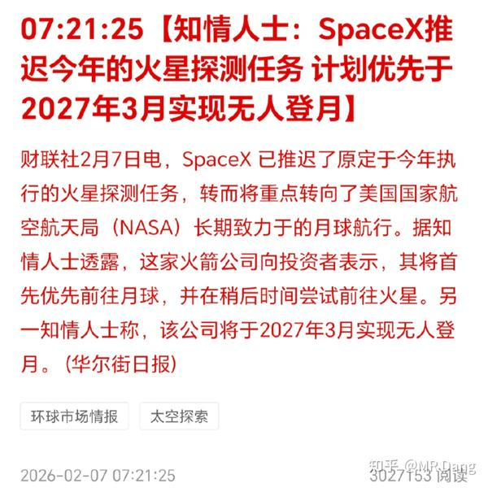

本来也没指望今年能去火星，老马画饼以后没实现的海了去了，不差这一个，这并不妨碍他能实现其中另一部分大饼。

---

重组消息：

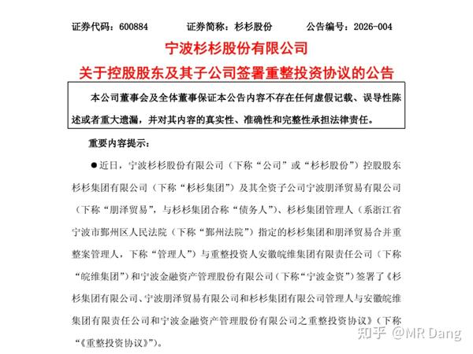

不出意外的，出消息前就涨停了。

这种事情很难评，大家都见怪不怪了。

作为散户能做的就是不要参与，远离这些出老千的。

要么买不到，等普通人能买到的时候，福祸难料。

---

字节发布了Seedance2.0模型：

实机演示非常震憾，图片➕运镜提示词就能做出电影质感的视频。

这对传统的影视行业是巨大的挑战，我自己也试用了下，连我这个纯门外汉都有点跃跃欲试的感觉。

这是属于中国的Sora时刻，可能会引起资本市场炒作相关概念股。

---

我个人净值的情况周末已经说了，就不啰嗦了。

最近遇到的比较多的问题是要持股过节还是持币过节？

我也不兜圈子了，我的建议是分类讨论。

有一些押注春节消费的，比如电影什么的，现在这个时间点可能是落袋为安的最后区间了，如果没有把握，就不要博弈节后的行情了，万一不及预期会比较难受。

其他和春节无关的，也不要太极端，要么满仓，要么空仓。根据自己风险偏好来，风险承受能力低的仓位低一些，多配置点银行股也行。

风险偏好高的仓位重一些，但是也别太满，就像音量键一样，不要一下静音一下拉满，找个适合自己的档位。

至于什么叫适合呢？就是春节期间万一外面出了黑天鹅，你的仓位也能让你在过年的时候不用天天担心股市。

---

然后就是重点说下**不要预测行情** 这个事。

大部分人，出厂的时候是没有配置预测功能这个模块的。

所以其实，你和巴菲特对股市第二天走势的预测可能处在同一水平线，50％准确率。

投资者如果主动预测股市的涨跌，就会不自觉的去抢跑，去做出自己的操作。

比如上周五，开盘前的早报，我的情绪也是比较悲观的。

有读者就捕捉到了，然后问了一下：

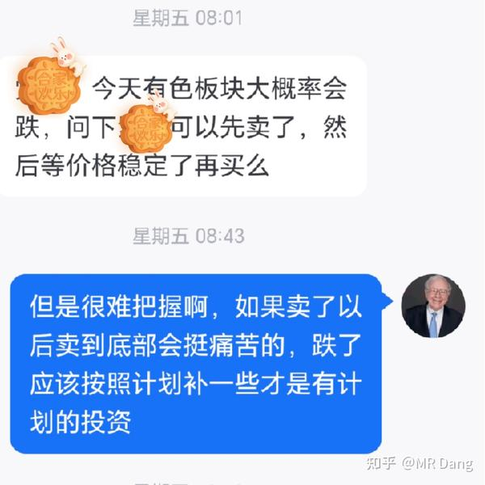

情绪悲观，那是因为盘前消息面不好。

但是我的原则是应对，是适应，是提前计划，而不是说预测它要跌，然后我先跑，等它跌了再买回来。

万一没按照预测的来，那不就亏大了么？

而预测准确的概率是多少？50％而已。

话句话说，有一半几率会吃亏，那我预测有什么用？

预测着玩，无所谓，全当娱乐了。但是根据预测的走势去做交易，风险很大很大，一定要谨慎。

---

本周前瞻：

 1，2月11日，也就是周三公布一月份的cpi和ppi，目前的预期是cpi同比0.5％，ppi同比逆增长1.5％。

cpi回落的因素主要是结构性错配，去年一月春节，基数高，今年春节在二月。

所以合理推测今年二月cpi增速高，也许会有些资金提前埋伏一下，这属于明牌，但是也能忽悠到小白。

2，同日，西大公布非农等重要数据。

3，美伊谈判会在本周继续展开。

---

今天读者数量正式破十万了，非常感谢大家一路的支持，能在春节前完成这个成就是我之前怎么也想不到的。

本来想忆苦思甜一下，发现没什么苦，全是甜，哈哈。

谢谢您嘞！

今天许愿一个本周开门红，看到这里的都给我红。

---

一个喜欢保护韭菜的博主，希望大家少少踩坑，多多赚钱！！！

