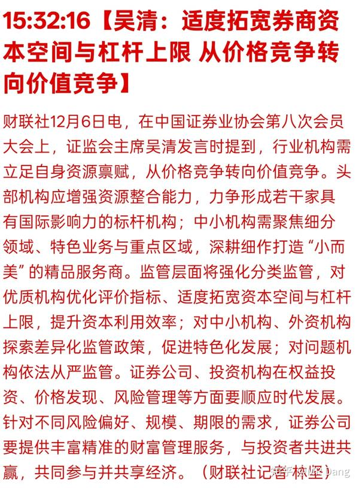
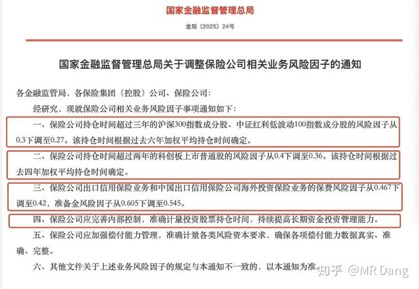
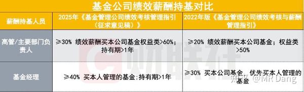
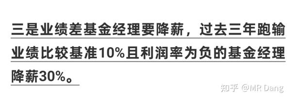
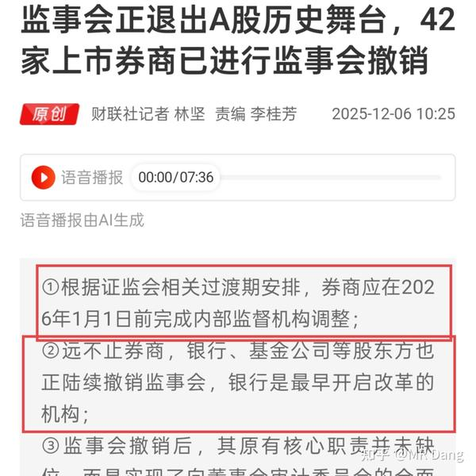
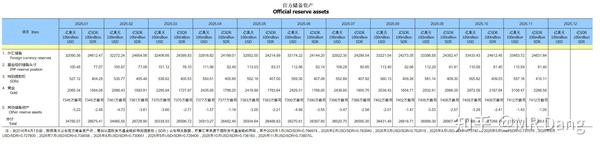
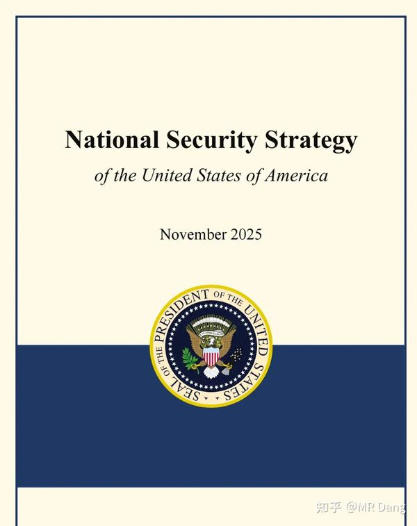
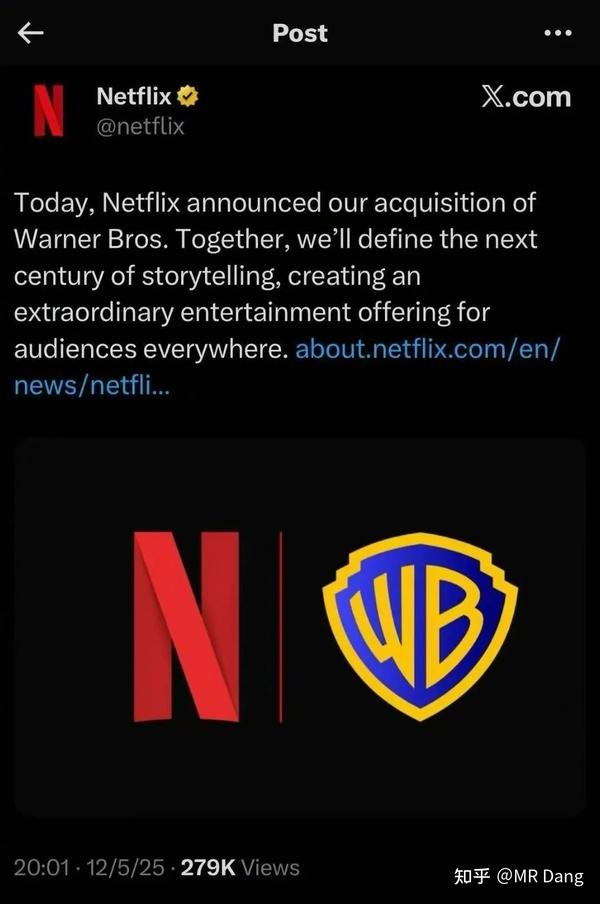
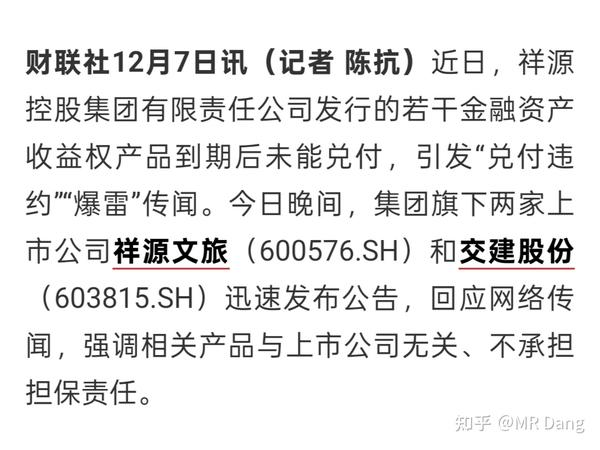

新的一周开始了，先把上周五收盘以后发生的重要事情过一遍。

---

国内方面，最出乎意料的是这个：

**券商** 放在以前，每次都是牛市的旗手，弹性和波动都是最大的板块之一。

只有这次牛市是例外。

要说原因的话，一方面是因为里面的资金都是互掏口袋，互相预判走位的老派资金，有人敢拉就有人敢砸。

另一方面还是现在券商太内卷，整体成交量上不去的话，没什么太宏大的叙事，就算有些券商的估值并不贵，也没什么太大的吸引力。

现在提到**杠杆上限，** 这个提法的想象空间其实挺大的。

另外别忘了还有三家券商还在停牌呢，如果放出来的时机能配合到一些这类的消息，还是有可能点燃市场的热情的，值得关注。

**但是有个膈应人的地方是，上周五券商涨了以后就出了这个利好。。。今天要是高开太多，这部分抢跑的资金要干什么好难猜啊。** 

---

除了券商，还有**保险** ：

这个也是类似的思路，给保险公司松绑，也相当于加杠杆。

如果和券商的那个表态结合起来看的话，隐隐约约有点2014年的味道了。

利好的话，险资配置的标的都是一些红利板块，标的直接问ai就行。

---

券商，险企都有了，怎么能少得了基金呢？

相关部门下发了基金业新的考核意见稿，主要变化如下：

主要是增加了高管需要购买本公司管理基金的比例，提高了总绩效的10%，增加了持有期规定，更加绑定了自身业绩。

三年跑输基准10%**并且** 亏损的降薪30%。

也就是说降薪需要**同时** 触发两个必要条件，亏损且跑输10%。

我个人觉得是利好价值投资的，因为做价值投资的话，在三年的时间长度上同时满足这两个条件也不容易。

**能同时满足这两个条件的，降薪30%也是罪有应得，真的太菜了。** 

---

和上述新闻一起搭配食用的还有：

券商等机构的监事会要被干掉了。

当然不是不监管了，而是把监事会的职责放到董事会审计委员会了。

自行体会。

---

本周三会公布cpi和ppi数据，我个人预测由于化肥涨价，**蔬菜水果可能同比涨幅在10%到15%区间** ，由此可能带动cpi同比增速1%到1.2%之间，ppi则是同比负增长2%左右。

这么大胆的预测目前还是比较少的，留待验证。

如果预测成立，那么**cpi和ppi会形成剪刀差** ，上一次这种情况是2019的猪肉大涨导致的，上上次这种情况是2014年“一带一路”天量投资砸下去导致的。

后续的资本市场在这种剪刀差出现后都还算可以，特别是2014年。

cpi数据的超预期公布可能会利好消费板块吧。

---

央妈公布了最新储备，如图所示：

再次怒买3万盎司**黄金，** 和前几个月节奏一致。

---

国际上的话，影响最深远的事情应当是：

简单的说，就是西大决定战略收缩了。

原因有很多，但是最本质的原因就一点：维持旧秩序所需要的边际成本太多，而边际收益又太少了，这本帐有点算不过来了。

与此同时，利用新的工具，比如算力，ai叙事，币圈叙事的收割边际成本非常低，所以最终就选择了战略收缩，划洋而治。

这个对资本市场的影响是深远的，因为货币是天生慕强的，所以在汇率这方面，大家懂的。

其实这一表态在几天前已经有预兆，当贝森特坐在镜头前说东大是西大的盟友的时候，不但在场的人懵了，屏幕前的人也懵了。

---

大宗商品方面，**银和铜** 目前处在逼空阶段，银价和铜价都在近期高位。

不过需要注意一点，尽管周末情绪上发酵比较多，但实际上这些大宗商品的最新价格和上周五a股收盘时基本处在同一水平线，没有进一步涨太多，也就是目前的股价已经price in截止今天开盘前的期货价格了。

逼空行情里的大宗商品价格变化会很剧烈，持有相关仓位的择时难度很大。

由于货币宽松的预期，金银铜铝锡都有非常好的长期涨价预期。

---

还有一个非常小众的农产品品种，由于今年扩产严重，价格下跌很多，二三季度有很多种植户亏损。

但是根据最新数据好像有点回升的意思。

明年供应可能会减少，种植户改种其他，叠加成本端的压力，可能会走出涨幅不小的单边行情。

这个品种就是洋葱，特别是粉葱。

洋葱这个品种特别奇怪，是西大唯一立法不允许开立期货的品种，因为历史上被爆炒过，所以特别出了个《洋葱期货法案》，没用的知识又增加了。

不过没什么好的投资标的，喜欢吃洋葱的可以囤几斤，应该能省下个块八毛的。

---

个股方面有个大新闻是奈飞收购案，对a股貌似没什么直接影响，不知道那些柚子能不能找到什么相关标的。

---

本周还有沐曦摇号，今天点赞的兄弟将会获得中签率+100%的buff加成，哈哈。

资本市场有点像后宫，当一个新人进宫的时候，旧人就会失宠。

emm，刚进宫还没两天的摩尔马上就要变成老人了。

提前祝大家都中签吧，中签后依然建议开盘竞价就卖，省心省力。

---

**百度** 发布公告，正在评估分拆昆仑芯。

百度这公司也算一大奇观了，每次都是起个大早，赶个晚集，这次不知道最后结果如何。

---

当然也不全是好消息，**祥源系** 据传暴雷，相关a股公司可能会风险释放空间。

---

美联储在本周内会公布最新的利率决议，目前市场是按照89%几率降息25基点在进行交易。

降息本来是利好，但是如果鹰派降息，也就是在降息的同时发表鹰派观点，也有可能变成利空和资本市场的震荡。

---

总的来说，周末的消息面上总体还是相当不错的，情绪偏好。

我的策略是一向只做应对计划，不预测市场，我个人的应对策略如下：

1，整体仓位方面，今天如果高开太多（6%以上），则会考虑开盘减仓，如果卖飞则不追回，如果回调则顺势调整仓位结构。

2，高开一般多（2%-6%），则按兵不动，并且盘中有低吸机会加仓。

3，高开不多（2%以内），则考虑根据情况直接加仓。

(这里不是指大盘指数，是指我持有的相关杂毛仓位)

标的方面，按照目前的价位，我偏向于银行，农化，有色里的铝王和锡王。

锡王我上个交易日在回补跳空缺口时买了些，如果今天有合适的机会会继续加。

铝王不会买太多，买一点作为标记。

因为我有色仓位里有铜王，而且仓位重，除非铜王清仓后，才会考虑换仓位到银王/铝王/锡王。

鄙人不善择时，不要模仿哈。

---

一个喜欢保护韭菜的博主，希望大家少少踩坑，多多赚钱！

