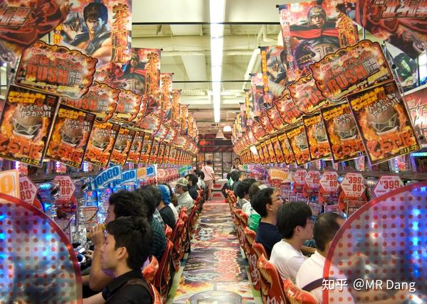

11区的人民有一种店铺，叫柏青哥。

也就是弹珠店。

11区是禁止公开bc的。

所以柏青哥开创性的发展出了完美循环。

赌徒在a店玩弹珠，赢了会有积分，当然积分就是积分，不能换成钱，换成钱就违法了。

巧合的是，旁边有一家店b，b店没啥别的爱好，就喜欢别人的积分，顾客可以用积分在b店换奖品。

更巧的是，b旁边还有一家店c，c的嗜好更特殊，就喜欢收集b店的奖品，用的都是真金白银。

至此，相亲相爱三家店形成完美循环，他们互不认识，没有关系，就是纯粹的用爱发电。

---

p公司发现这个商业模式简直太有才了。

但是在c国，这个管的更严。

怎么办呢？需要一个更加强大的版本。

那个弹珠还是太low了，把弹珠要升级的更与众不同，赋予文化内涵，不如做成玩具，积分功能直接集成到玩具上，用稀有度表示，设计成隐藏款，联名款等。

那个收集积分的b店和用真金白银换奖品的c店设计还是太复杂了，成本还高。

不如换到线上，世界之大无奇不有，乐意用天价收购玩具的爱好者在海鲜市场为爱发电又有什么错呢？

但是如果所有玩具都是天价，一方面没有门槛太高，导致没有参与性，另一方面现金流吃紧。

因此这个数量是关键。

只有数量够少，才有稀有性。

稀有性一方面可以有利于传播，提升品牌价值。

另一方面，数量少了炒的价格再高都无所谓，资金能跟上。

至于目标人群，当然是年轻人啦。

年轻人喜欢炒鞋，炒cs饰品，主打一个文化认同，情绪价值。

再来点出圈的传播，把圈层认同之类的加进去，完美。

这类产品的消费者，不怕买的东西贵。

**他怕的是买的贵，但是没人认识。** 

只要贵的出名，贵的离谱，贵的让人无法理解。

那这件东西就算是做成了。

区区凡人，怎么能理解小众圈子的爱好呢。

普通人越不理解，才越能表明自己的special啊。

---

事实证明这个商业模式取得了巨大的成功：在一个禁止bc的地方，把随机性做成高附加值的商品，由于里面成分太多，bc这一个成份就被隐藏了起来。

同时因为现代媒介的传播速度，所以其高价格和稀缺性以短时间内形成共识，这个共识进一步刺激了需求，形成了左脚踩右脚，原地升天的正循环。

在最离谱的时候，居然有很多人相信在c国这个工业克鲁苏的国度，生产这种玩具会有产能瓶颈。

我不太懂这里面的核心科技有什么，但是我相信以义乌的生产力，要不是有版权限制，这玩具能论斤卖。

---

一个喜欢保护韭菜的博主，希望大家少踩坑，多赚钱。

