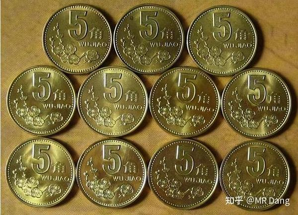

为什么都在纠结要不要硬币熔成金属？

这个重要么？

可转债最后都会转成正股么？

期货最后都会交割么？

期权最后都会行权么？

他的行为在经济学上，可以认为是0溢价买了一份以现钞美元为底层资产，随时转换为铜和镍的可转债。

或者是0成本(严格来说有时间成本)的看多铜和镍的实值期权。

期权是什么？是赋予持有人的权利，任何期权的权利本身都是有价值的，可0成本够买本身就是赚的。

何况他的期权现在是实值期权(马上行权即可获利)。

至于行权的难度，根本不重要。

以5美分每年十几亿枚的发行量，每年的发行市值仅仅不到一亿美元。

以美国的经济体量和这个故事的流传范围之广，马上5美分硬币就会被有心人悄悄收集，这个小众赛道根本经不起大资金的冲击。

6美分只是他的金属成本，按照可转债的溢价规律，很可能就会溢价到7美分甚至更高。

而这个时候，故事的主人公只需要略加出手，即可获利，潇洒离场。

需要熔化么？

只要形成共识就可以变现。

复盘他的一系列行为。

发现套利空间，观察敏锐。

执行套利空间，执行力强。

宣传策略形成共识，效果显著。

现在只差高位套现，轻轻松松无风险获利40%以上。

与此同时很多人还在纠结怎么熔化硬币？

——————分割线————

你的思路确实很好，但是我买不到5美分硬币啊，在国内有没有什么类似的好的思路呢？

有的，兄弟，有的。

梅花五角硬币，币重3.8克，75%铜，25%锌，以目前87660/吨铜价，22300/吨锌价计算。

梅花五角的金属成本为0.27元。

距离5毛的面值还有85%的空间。

意味着现在原价入手梅花五角，等于免费获得了一份铜锌价格上涨85%以后可以行权的看多期权。

如果有原价入手的机会，不可错过哦。

————————分割线——————

一个喜欢保护韭菜的博主，希望大家少踩坑，多赚钱！

