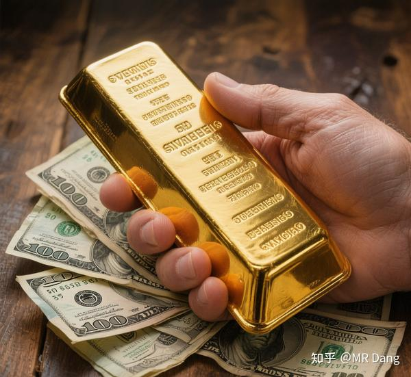

热度过了，可以说下我对普通人的建议：

**要么别买黄金，要么就买实体金条。** 

每次给人配置资产时，如果我觉得有必要配置黄金，我都会在黄金前面加上**实体** 两个字，必须粗体突出。

为什么呢？因为黄金的作用就是避险。

什么是避险？就是**极端情况下** 的最后一根稻草。

你如果不理解什么叫极端情况，可以想想巨大的自然灾害后的样子(比如大地震)。

电力，通讯，公共交通网络全部瘫痪后。

黄金是依然可以自由流通的一般等价物。

有人会告诉你，都什么年代了，积存金，黄金etf，纸黄金，流通性又好，交易手续费又低，为什么不买呢？

我说几个事：

---

1，**1816年** ，英国通过《金本位制度方案》，规定1英镑=7.3克黄金。

同时期，由于中国的产品丝绸茶叶等，在西方广受欢迎，中国产生巨大的贸易顺差。

而中国当时是银本位制，所以大量白银流入到中国。

欧洲一看这不行啊，就有了后来的鸦片战争和丧权辱国(相关历史国人应该很熟了，就不展开了)，本质就是为了把白银再弄回去。

在签订条约的时候，最出名的就是《辛丑条约》的庚子赔款，啥时间呢，**1902——1935** ，还有个专门的名词，叫“镑亏”：

本来签了4.5亿两白银的赔款，但是因为英镑和黄金挂钩，黄金升值，白银贬值，最后算上利息，一共赔了9.8亿两白银。

巧合的是，中国马上要赔完的时候，**1931** 年，英国放弃金本位制度，英镑和黄金脱钩。

**黄金幻觉维持时间=115年** 

---

2，1944年，布雷顿森林体系建立，美元挂钩黄金，35美元=1盎司。

1971年8月，尼克松宣布挂钩结束。

**黄金幻觉维持时间=27年** 

---

3，1948年8月，光头宣布1金圆券=0.222克黄金。

1949年7月，金圆券变成废纸。

**黄金幻觉维持时间=300天** 

---

**每隔一段时间，总会有人跳出来，告诉别人自己设计的系统有多么合理，自己的纸为什么会等于你的黄金。** 

不过只要你学过辩证唯物主义，你就应当知道，**黄金就是黄金，纸就是纸** ，黄金不会变成纸，纸也不会变成黄金。

你可以用你的纸去换别人的黄金，但是别拿你的黄金去换别人的纸。

不要试图去了解纸有什么优越性，纸再优越都是纸，黄金在粪坑里也是黄金。

不要去欣赏纸上的图案，图案再漂亮，那也不是炼成阵，**世界上没有炼金术。** 

---

这件事情的重点，根本就不是到底对哪个环节征税了，研究那个有什么用呢？

今天能对这个环节征，明天就能对那个环节征。

**征税本身就是信号。** 

枪响了第一反应应该是躲起来藏好。

而不是去争论子弹到底落在哪里了。

那是傻狍子才会干的事情。

还有人还把黄金分为投资和非投资：纸黄金是金融投资的，实物黄金是非金融投资的。

让人看了想笑，可那明明就是纸和黄金的区别啊，兄弟。

---

一个不算冷的热知识，但是我发现很多人还不知道：

《中华人民共和国金银管理条例》第九条规定：“从事金银生产的厂矿企业、农村社队、部队和个人所采炼的金银，**必须全部交售给中国人民银行，不得自行销售、交换和留用。” ** 

上金所的交易环节是交售给央行的后续环节。

什么东西是珍贵的，自行判断吧。

---

至于怎么买金条。。

以经验来说工农中建四大行里，建设银行的投资金条最便宜，目前应该不到920。

那还有没有更便宜的黄金呢？

有的，兄弟，有的。

如果你恰好路过香港，又恰好路过上环，又恰好看见金城金条之类的金店，进去转一圈身上又恰好多了50克黄金，恰好顶着限额入关了，这很合理吧(一般情况下一克能便宜5到10块，套利空间不大，没必要特意跑一趟)

你要头铁买国内1100多的首饰金来保值增值，那我只能说算你狠。

---

一个喜欢保护韭菜的博主，希望大家少踩坑多赚钱。

